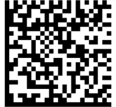

# DataMatrix 

Data Matrix barcode is a two-dimensional type of code used widely in industry for marking small parts and items due to its high data density and reliability. Data Matrix code consists of dark and light square cells that form a matrix. The produced code can be square or rectangular and can have size up to 144x144 for square codes or 16x48 for rectangular codes. To provide better readability, the Data Matrix code includes error correction algorithm, allowing to reconstruct up to 30% of damaged code image.

#### Figure 1: DataMatrix Barcode

## DataMatrix Barcode Structure

* **Finder pattern**: The L-shaped lines at the bottom and left of the code are called "finder pattern". It is used by the readers for orientation, adjustment and to correct distortion.

* **Module size**: the smallest cell in the code graphical representation. The module size is recommended to be at least 2x2 printed dots for better readability.

* **Timing pattern**: The lines at the top and right of the code are called "timing pattern". It provides information about the barcode size.

* **Data area**: The area surrounded by the finding pattern and timing pattern. Contains the modules that encode the barcode contents.

The size of the Data Matrix code depends on module size, length and type of its contents. The contents type determines if the encoded value contains only numerical characters or includes ASCII or Unicode characters. The following table shows the correlation between the content type, content length and matrix size:

| COUNT OF NUMERICAL CHARACTERS | COUNT OF ASCII CHARACTERS | MATRIX SIZE |
|---------|---------|---------|
6 |3 | 10x10
10 | 6 | 12x12
16 | 10 | 14x14
24 | 16 | 16x16
36 | 25 | 18x18
44 | 31 | 20x20
60 | 43 | 22x22
72 | 52 | 24x24
88 | 64 | 26x26
124 | 91 | 32x32

## Encodation

The encodation determines the type of contents encoded by the Data Matrix barcode. Choosing a proper encodation imposes validation rules, but reduces the barcode size and improves its readability.

The following table shows the supported encodations and provides information about their restrictions and data storing requirements:

* **ASCII**: Allowed characters include double digit numerics and all values from the ASCII table. The double digit numerics use 4 bits. The ASCII values in the 0-127 range use 8 bits. The ASCII values in 128-255 range use 16 bits.

* **C40**: Used primarily for upper-case alphanumerics. The upper-case alphanumeric characters use 5.33 bits. The lower-case and special characters use 10.66 bits.

* **Text**: Used primarily for lower-case alphanumerics. The lower-case alphanumeric characters use 5.33 bits. The upper-case and special characters use 10.66 bits.

* **X12**: Uses the characters from ANSI X12 EDI data set. Each character takes 5.33 bits.

* **EDIFACT**: Used to encode ASCII values in the 32-94 range. Each character takes 6 bits.

* **Base256**: Used to encode characters in the whole ASCII range. Each character takes 8 bits.

* **AsciiGS1**: Used to encode FNC1 characters in the ASCII range

## Symbol Size

Sets the symbol size and shape of the generated barcode. It can be automatically determined using SquareAuto or RectangleAuto, or specific like __Square32x32__ or __Rectangle16x48__.

## Text Encoding

Determines character encoding used to encode the barcode contents. By default it is set to UTF-8, which uses more bits per character and may increase the size of the barcode image.

## Example 

Check below a quick example with DataMatrix symbology applied to RadBarcode.

First, add the *telerikBarcode* namespace:

<snippet id='xmlns-telerikbarcode'/>

Then, add the Barcode definition:

<snippet id='datamatrix-example-xaml' />

Here is the result:

## See Also

- [Key Features]()
- [Supported Barcodes]()
