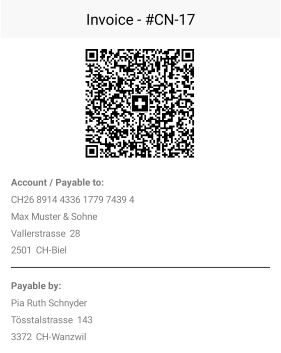
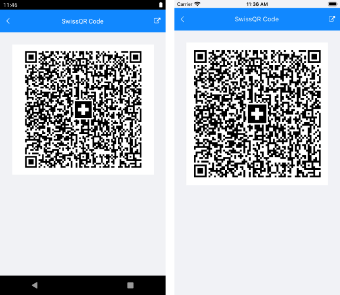

# SwissQRCode 

The QR-bill makes issuing and paying invoices simpler, and is being introduced throughout Switzerland to modernize payment transactions. Its most striking feature is the Swiss QR code, which contains all the payment information in a digital format, which can be read using a smartphone or a slip scanner.

#### Figure 1: A Swiss QR-bill

The Swiss QR Code encodes all the information necessary for a payment in specific format and structure. Along with the printed information, the Swiss QR Code forms the payment part of the QR-bill. The allowed currencies for payments are CHF and EUR. The QR-Bill also guarantees you compliance with the regulatory requirements arising from the revised Anti-Money Laundering Ordinance.

## Requirements

The Swiss QR Code symbol requires an error correction level **"M"**, which means a redundancy or assurance of **around 15%**.

In addition, the measurements of the Swiss QR Code for printing must always be **46 x 46 mm** (without surrounding quiet space) regardless of the Swiss QR Code version. Depending on the printer resolution, the Swiss QR Code produced might require size adjustments.

## Generating a Swiss Barcode

To generate a Swiss Barcode using Telerik UI for Xamarin, you need to first set the **Symbology** of the Barcode to **SwissQRCode**.

<snippet id='swissqrbarcode-example-xaml' />

The Swiss QR code standard mandates that the input provided for the generation of the barcode is strictly formatted. Both validating and generating this input are complex processes and to facilitate them you can use the **SwissQRCodeValueStringBuilder** helper class. Its purpose is to hold the information needed for a SwissQRCode in a type-safe manner, to validate this information and to generate the input. Through its constructor, you need to set the following properties:

* **Iban**: The IBAN of the Account/Payable to.
* **Currency**: The currency of the payment - **CHF** or **EUR**.
* **Creditor**: The information of the contact that receives the payment.
* **Reference**: The reference information for the payment.
* **AdditionalInformation**: The additional information for the payment.
* **Debtor**: The information of the contact that makes the payment.
* **Amount**: The amount of the payment.
* **AlternativeProcedure**: The alternative procedures for the payment.

<snippet id='swissqrbarcode-example-builder' />

Once you've set up the SwissQRCodeValueStringBuilder you can call its **Validate** method which validates all its fields and the relations between them. The method returns a string which contains the accumulated errors. If there are no errors - **null** is returned. In this case, you can call the **BuildValue** method of the string builder which will build the string value to be provided to the RadBarcode.

<snippet id='swissqrbarcode-example-validate' />

Invoking the code from the above snippets will generate the following result:

## See Also

- [Key Features]()
- [Supported Barcodes]()