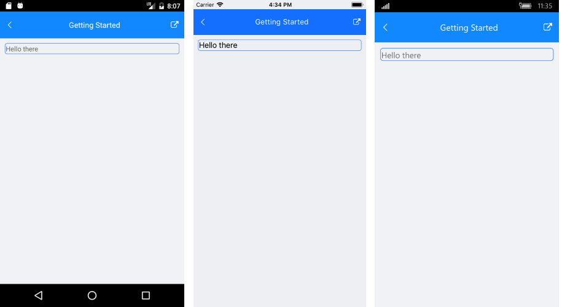

# Getting Started
   
This example will guide you through the steps needed to add a basic **RadBorder** control in your application.

>Before you proceed, please, take a look at these articles and follow the instructions to setup your app:
>
>- [Setup on Windows]()
>- [Setup on Mac]()

## Required Telerik Assemblies

| Platform | Assemblies |
| -------- | ---------- |
| Portable | Telerik.XamarinForms.Primitives.dll |
| Android  | Telerik.Xamarin.Android.Primitives.dll  Telerik.XamarinForms.Primitives.dll |
| iOS      | Telerik.Xamarin.iOS.dll  Telerik.XamarinForms.Primitives.dll |
| UWP      | Telerik.Core.dll   Telerik.UI.Xaml.Primitives.UWP.dll  Telerik.XamarinForms.Common.dll  Telerik.XamarinForms.Primitives.dll |

> The path of the assemblies is relative to the `Binaries` folder that is located in the installation folder of the controls. The default location is: `C:\Program Files (x86)\Progress\Telerik UI for Xamarin RX XXX\Binaries`.
>
> All binaries built for a specific platform are placed in a folder named after that platform.

## Example

If your app is correctly set, you are ready to add a **RadBorder** control to the page. In the example RadBorder wraps around a Label: 

<snippet id='border-getting-started-xaml'/>

In addition to this, you need to add the following namespace:

<snippet id='xmlns-telerikprimitives'/>
<snippet id='ns-telerikprimitives'/>

Here is the result:

>important **SDK Browser** and **QSF** applications contain different examples that show RadBorder's main features. You can find the applications in the **Examples** and **QSF** folders of your local **Telerik UI for Xamarin** installation.

## See Also

- [Key Features]()