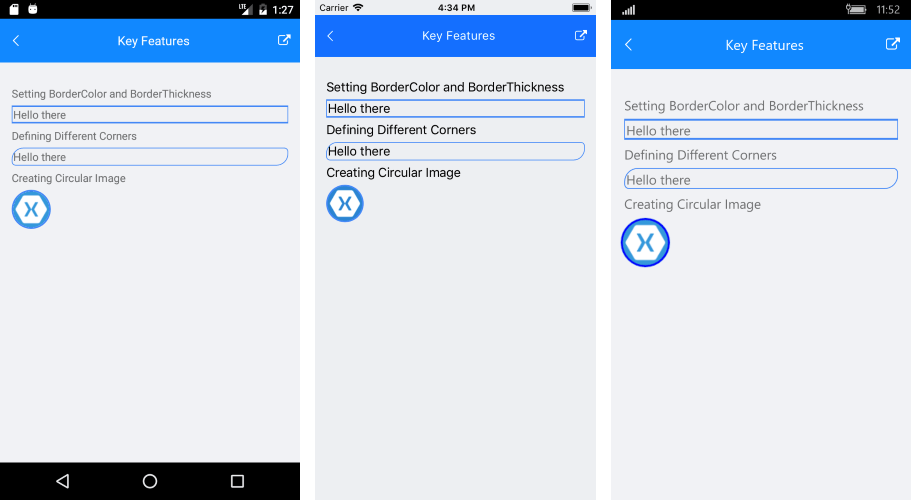

# Key Features

The purpose of this help article is to show you the key features of the **RadBorder** control. 

## Setting Border Color

You can use the **BorderColor** property to specify the color of RadBorder. The property has no effect if BorderThickness is set to “0”.

## Setting Border Thickness

The **BorderThickness** property is of type *Xamarin.Forms.Thickness* and is used to set the borders’ width. Type Thickness gives you the option to define different border on each side of the surrounded element.

Here is a quick example on how to use BorderColor and BorderThickness properties:

<snippet id='border-features-thickness'/>

Where:

<snippet id='xmlns-telerikprimitives'/>

## Defining Different Corners

The **CornerRadius** property represents the degree to which the corners of the Border are rounded. CornerRadius is of type *Xamarin.Forms.Thickness* so it allows you to set separate values on the four corners of the border. 

<snippet id='border-features-cornerradius'/>

Additionally, the wrapped content will be clipped according to each side’s specified corner radius. The next example shows how you could have circle image by wrapping Image control with RadBorder.

<snippet id='border-features-circularimage'/>

Here is the end result:

## See Also

- [Getting Started]()
