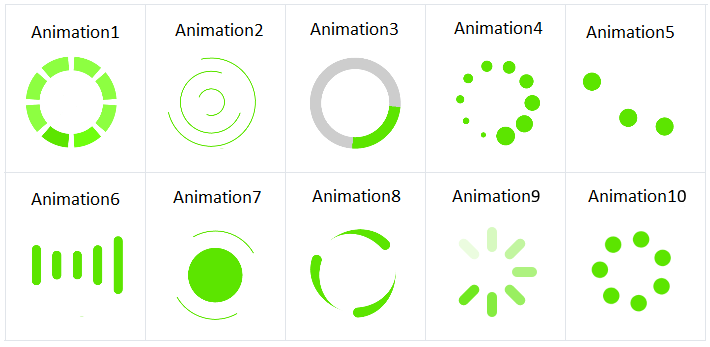

# Animations

## Built-in Animations

**RadBusyIndicator** provides a set of built-in animations which you can use. They can be changed via the **AnimationType** property. 

The property is an enum called AnimationType and it accepts values named **Animation1** to **Animation10**. Animation1, Animation2, Animation3, etc. to Animation10. **Animation1** is the default one. 

 

> The animation will be displayed only when the **IsBusy** property is set to **True**.
	
### Changing animation size and color

You can set the size of the animation content, which is the animated element. This can be done via the **AnimationContentWidthRequest** and **AnimationContentHeightRequest** properties. By default the size of the default animation content is 25x25 pixels.

You can also change the color of the animation with the **AnimationColor** property.

The snippet below shows how you can configure the predefined animations of RadBusyIndicator:

<snippet id='busyindicator-animations-settings' />

Here is the result on different platforms:

> **AnimationContentWidthRequest**, **AnimationContentHeightRequest** and **AnimationColor** won't be applied if you use custom animation.
	
## Custom animation

You can create a custom animation using a combination of 3 properties - Animations, BusyContent and AnimationType.

* To tell the control that a custom animation is used you can set the **AnimationType** to **Custom**
* The **BusyContent** holds the view that will be animated.
* The custom animation is added in the **Animations** collection of the busy indicator

The following example demonstrates how to create a custom animation that changes the opacity of a text (blinking effect).

### Defining custom animation in Xaml

<snippet id='busyindicator-animations-xaml'/>
<snippet id='busyindicator-animations-code'/>

### Defining custom animation in code-behind

<snippet id='busyindicator-animations-csharp'/>

## See Also

- [Project Wizard]()
- [Getting Started]()