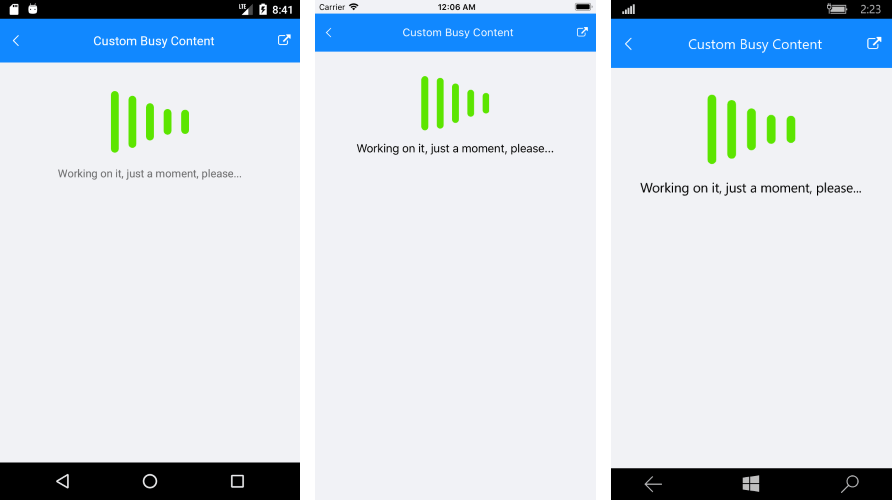

#  Custom Busy Content

Setting **BusyContent** property of RadBusyIndicator allows you to display any content together with the built-in animations while the control is in Busy state. 
Additionally, you could customize the **BusyContentTemplate** in order to arrange the custom content and the animated content per your choice.

Here is a quick example demonstrating how BusyContent and BusyContentTemplate properties could be applied.

<snippet id='busyindicator-custombusycontent-xaml' />

Also you will need to add the **telerikPrimitives** namespace:

<snippet id='xmlns-telerikprimitives' />

You could check the result in the image below:

#### __Figure 1: RadBusyIndicator with BusyContentTemplate__  

## See Also

- [Animations]()