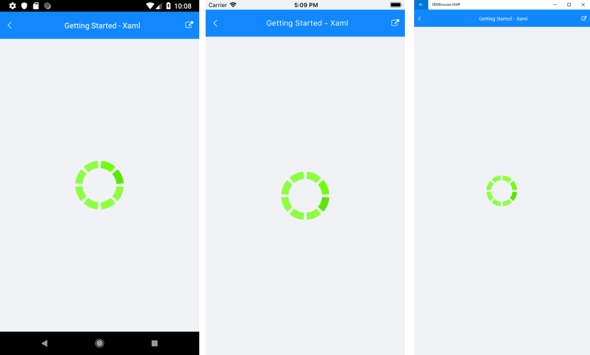

# Getting Started

This article will guide you through the steps needed to add a basic **RadBusyIndicator** control in your application.

## 1. Setting up the app

Take a look at these articles and follow the instructions to setup your app:

- [Setup app with Telerik UI for Xamarin on Windows]()
- [Setup app with Telerik UI for Xamarin on Mac]()

## 2. Adding the required Telerik references

You have two options:

* Add the Telerik UI for Xamarin Nuget packages following the instructions in [Telerik NuGet package server]() topic.

* Add the references to Telerik assemblies manually, check the list below with the required assemblies for **RadBusyIndicator** component:

| Platform | Assemblies |
| -------- | ---------- |
| Portable | Telerik.XamarinForms.Common.dll   Telerik.XamarinForms.Primitives.dll   Telerik.XamarinForms.SkiaSharp.dll |
| Android  | Telerik.XamarinForms.Common.dll   Telerik.XamarinForms.Primitives.dll   Telerik.XamarinForms.SkiaSharp.dll |
| iOS      | Telerik.XamarinForms.Common.dll   Telerik.XamarinForms.Primitives.dll   Telerik.XamarinForms.SkiaSharp.dll |
| UWP      | Telerik.XamarinForms.Common.dll   Telerik.XamarinForms.Primitives.dll   Telerik.XamarinForms.SkiaSharp.dll |

>important RadBusyIndicator is rendered via the **SkiaSharp** graphics library so you need to install also [SkiaSharp.Views.Forms](https://www.nuget.org/packages/SkiaSharp.Views.Forms) in all projects of the xamarin solution (portable, android, ios, etc). 

## 3. Adding RadBusyIndicator control

The busy indicator is a layout control that can display two views depending on its current state - busy and not-busy. You can define the state of the control via its **IsBusy** property. The default value is False and the control's normal content is displayed. If you change it to True, the busy content is displayed, which by default is a spinning balls animation. Check the [Animations]() article to see the built-in animations, how to change them and how to us a custom animation.

You could use one of the following approaches:

#### Drag the control from the Toolbox. 

Take a look at the following topics on how to use the toolbox:

* [Telerik UI for Xamarin Toolbox on Windows]()
* [Telerik UI for Xamarin Toolbox on Mac]()
	
#### Create the control definition in XAML or C#.

To use the busy indicator you can include the following namespaces:

<snippet id='xmlns-telerikbusyindicator'/>
<snippet id='ns-telerikbusyindicator'/>

Proceed with defining the component:

<snippet id='busyindicator-getting-started-xaml'/>
<snippet id='busyindicator-getting-started-csharp'/>

#### Figure 1: RadBusyIndicator when IsBusy is True 

>important **SDK Browser** and **QSF** applications contain different examples that show RadBusyIndicator's main features. You can find the applications in the **Examples** and **QSF** folders of your local **Telerik UI for Xamarin** installation.

### See Also

- [Animations]()
- [Custom Busy Content]()
