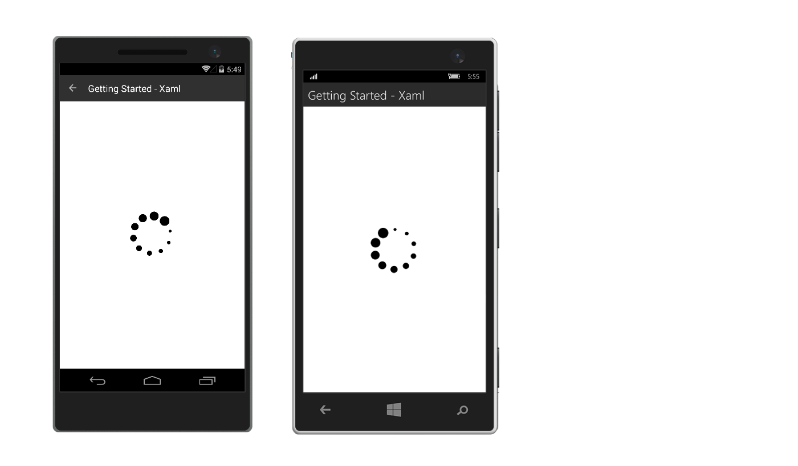

# Overview

**RadBusyIndicator for Xamarin** allows you to display a notification whenever a longer-running process is being handled by the application. This makes the UI more informative and the user experience smoother.

#### Figure 1: RadBusyIndicator Overview

 

## Key features

- **Built-in animations**: The busy indicator component provides few built-in animations which you can use. Find more about this in the [Animations]() help article.
- **Custom busy content and animations**: The control allows you to define a custom content and animate it using **RadAnimation**. Find more about this in the [Animations]() article.

## See Also

- [Project Wizard]()
- [Getting Started]()