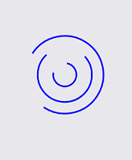

# Animations

**RadBusyIndicator** provides couple built-in animations which you can use. They can be changed via the **AnimationType** property. 

The property is of type AnimationType enum and it accepts the following values:

- **SpinningBalls**: This is the default animation.
	 
- **SpinningArcs**
	 

> The animation will be displayed only when the **IsBusy** property is set to **True**.
	
## Custom animation

You can create a custom animation using a combination of 3 properties - Animations, BusyContent and AnimationType.

* To tell the control that a custom animation is used you can set the **AnimationType** to **Custom**
* The **BusyContent** holds the view that will be animated.
* The custom animation is added in the **Animations** collection of the busy indicator

The following example demonstrates how to create a custom animation that changes the opacity of a text (blinking effect).

### Defining custom animation in Xaml

<snippet id='busyindicator-animations-xaml'/>
<snippet id='busyindicator-animations-code'/>

### Defining custom animation in code-behind

<snippet id='busyindicator-animations-csharp'/>

## See Also

- [Project Wizard]()
- [Getting Started]()