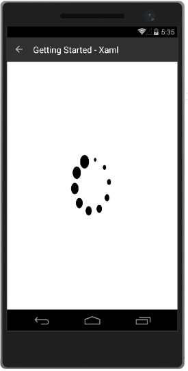
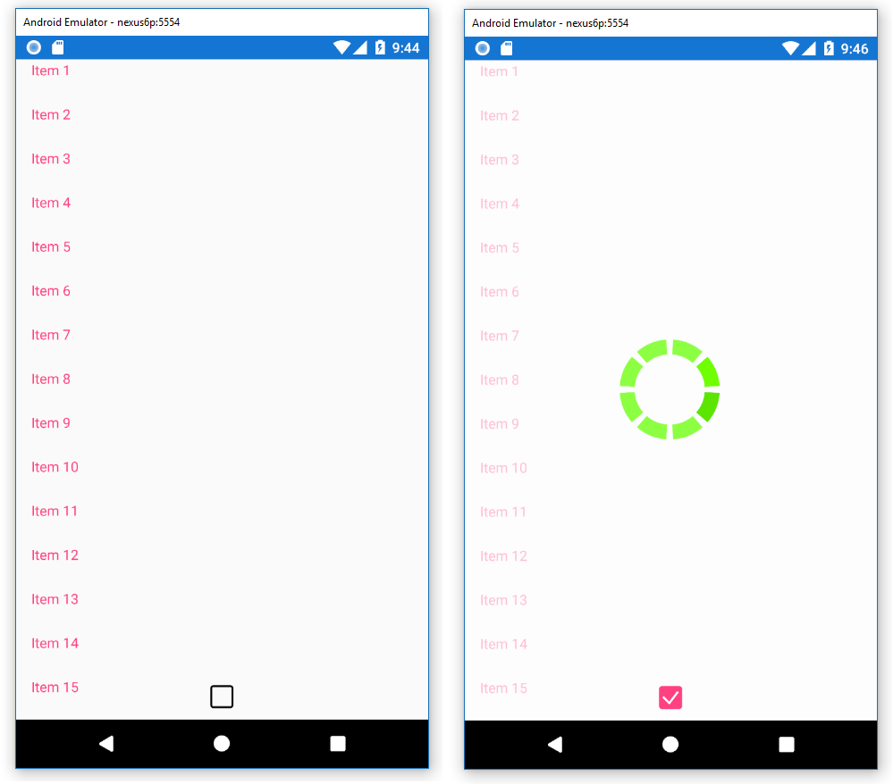

# Getting Started

This article demonstrates how to create a sample application that contains **RadBusyIndicator**.

>Before you proceed, please, take a look at these articles and follow the instructions to setup your app:

>- [Setup on Windows]()
>- [Setup on Mac]()
>- [Required Telerik Assemblies]()
> **RadBusyIndicator** is rendered via the SkiaSharp graphics library so you need to install [SkiaSharp.Views.Forms](https://www.nuget.org/packages/SkiaSharp.Views.Forms/1.55.0).

The busy indicator is a layout control that can display two views depending on its current state - busy and not-busy. You can define the state of the control via its **IsBusy** property. The default value is False and the control's normal content is displayed. If you change it to True, the busy content is displayed, which by default is a spinning balls animation. Check the [Animations]() article to see the built-in animations, how to change them and how to us a custom animation.

## Example

To use the busy indicator you can include the following namespaces:

<snippet id='xmlns-telerikbusyindicator'/>
<snippet id='ns-telerikbusyindicator'/>

Proceed with defining the component:

<snippet id='busyindicator-getting-started-xaml'/>
<snippet id='busyindicator-getting-started-csharp'/>

#### __Figure 1: RadBusyIndicator when IsBusy is True__  


#### __Figure 2: RadBusyIndicator when IsBusy is False__  


>important **SDK Browser** and **QSF** applications contain different examples that show RadBusyIndicator's main features. You can find the applications in the **Examples** and **QSF** folders of your local **Telerik UI for Xamarin** installation.


## Troubleshooting

The View elements inside the **RadBusyIndicator.Content** are removed from the visual tree when `IsBusy=True`. This can cause issues on some platforms when the content contains a data bound control.

To address these use cases, you can take the following approach:

1. Re-position the RadBusyIndicator on top of the content
2. Set the `BackgroundColor` with a semi-transparent color
3. Bind the `IsBusy` and `IsVisible` to the same property


#### Example:

Let's use a data bound RadListView as an example

**Before**

```XML
<primitives:RadBusyIndicator BackgroundColor="#AAFFFFFF"
                             IsBusy="{Binding IsBusy}">
    <primitives:RadBusyIndicator.Content>
        <Grid>
            <!-- RadListView is within the RadBusyIndicator.Content -->
            <dataControls:RadListView ItemsSource="{Binding MyItems}" />
        </Grid>
    </primitives:RadBusyIndicator.Content>
</primitives:RadBusyIndicator>

```

**After (*recommended*)**

```XML
<Grid>
    <!-- RadListView is the lowest visual element in the Grid's children -->
    <dataControls:RadListView ItemsSource="{Binding MyItems}" />

    <!-- The RadBusyIndicator is on top of the RadListView -->
    <primitives:RadBusyIndicator BackgroundColor="#AAFFFFFF"
                                 IsBusy="{Binding IsBusy}"
                                 IsVisible="{Binding IsBusy}"/>
</Grid>
```

#### Result   


### See Also

- [Project Wizard]()
- [Getting Started on Windows]()
- [Getting Started on Mac]()
