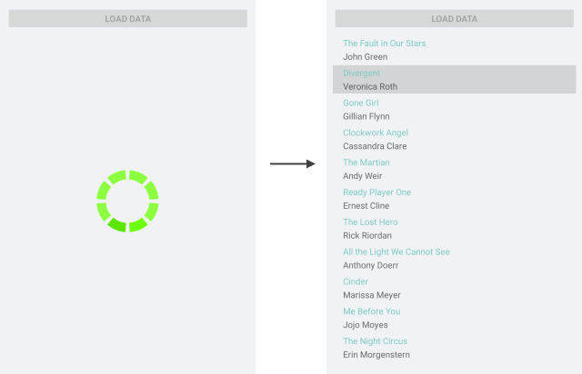

#  Integrate with ListView

RadBusyIndicator is useful in scenarios whether you'd like to display a notification to the end users of the app while a long-running operation, such as loading data from a service, is currently in progress. 

The example below demonstrates a sample integration of RadBusyIndicator with RadListView control. The ListView loads its data asynchronously (this is simulated for the purpose of the example) and while the load operation is taking place, RadBusyIndicator IsBusy state is enabled.

First, create a sample **Book** class used for the ItemsSource of the ListView:

<snippet id='busyindicator-withlistview-model' />

Then, add a ViewModel class, which provides the following:

* Collection of *Book* objects that is used for binding the ListView;
* Boolean *IsLoading* property to control the BusyIndicator's busy state;
* LoadData command that starts the loading of the items;

<snippet id='busyindicator-withlistview-csharp' />

Add the ListView and BusyIndicator controls to the view:

<snippet id='busyindicator-withlistview-xaml' />

Lastly, set the ViewModel class as BindingContext of the page:

<snippet id='busyindicator-withlistview-setvm' />

The image below shows the result:

>important [SDK Browser application](https://docs.telerik.com/devtools/xamarin/sdk-browser-overview#sdk-browser-application) contains a sample ListView Integration example. You can find it in the **BusyIndicator/HowTo** folder.

## See Also

- [Animations]()