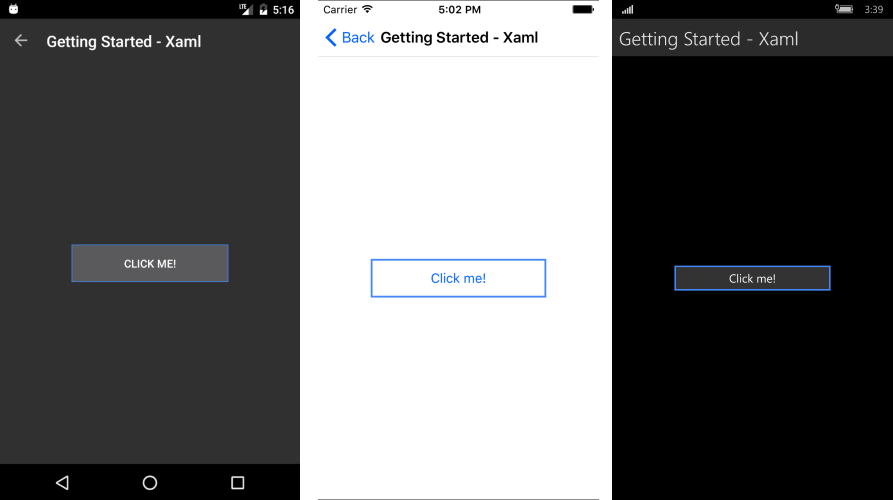

# Getting Started

This article will guide you through the steps needed to add a basic **RadButton** control in your application.

* [Setting up the app](#1-setting-up-the-app)
* [Adding the required Telerik references](#2-adding-the-required-telerik-references)
* [Adding RadButton control](#3-adding-radbutton-control)

## 1. Setting up the app

Take a look at these articles and follow the instructions to setup your app:

- [Setup app with Telerik UI for Xamarin on Windows]()
- [Setup app with Telerik UI for Xamarin on Mac]()

## 2. Adding the required Telerik references

You have two options:

* Add the Telerik UI for Xamarin Nuget package following the instructions in [Telerik NuGet package server]() topic.

If you don't want to add the all Telerik.UI.for.Xamarin nuget package, you have the option to add a separate nuget package. For RadButton control you have to install the **Telerik.UI.for.Xamarin.Input** nuget package. This nuget will automatically refer the Telerik.UI.for.Xamarin.Primitives, Telerik.UI.for.Xamarin.Common, and Telerik.UI.for.Xamarin.DataControls nuget packages.

* Add the references to Telerik assemblies manually, check the list below with the required assemblies for **RadButton** component:

| Platform | Assemblies |
| -------- | ---------- |
| Portable | Telerik.XamarinForms.Common.dll Telerik.XamarinForms.Input.dll Telerik.XamarinForms.DataControls.dll |
| Android  | Telerik.Xamarin.Android.Common.dll Telerik.Xamarin.Android.Data.dll  Telerik.Xamarin.Android.Input.dll Telerik.Xamarin.Android.List.dll Telerik.Xamarin.Android.Primitives.dll Telerik.XamarinForms.Common.dll  Telerik.XamarinForms.Input.dll  Telerik.XamarinForms.DataControls.dll |
| iOS      | Telerik.Xamarin.iOS.dll  Telerik.XamarinForms.Common.dll Telerik.XamarinForms.Input.dll Telerik.XamarinForms.DataControls.dll |
| UWP      | Telerik.Core.dll Telerik.Data.dll   Telerik.UI.Xaml.Controls.Data.UWP.dll  Telerik.UI.Xaml.Input.UWP.dll Telerik.UI.Xaml.Primitives.UWP.dll Telerik.XamarinForms.Common.dll Telerik.XamarinForms.Input.dll Telerik.XamarinForms.DataControls.dll |

## 3. Adding RadButton control

You could use one of the following approaches:

#### Drag the control from the Toolbox. 

Take a look at the following topics on how to use the toolbox:

* [Telerik UI for Xamarin Toolbox on Windows]()
* [Telerik UI for Xamarin Toolbox on Mac]()
	
#### Create the control definition in XAML or C#.

The snippet below shows a simple RadButton definition:

<snippet id='button-getting-started-xaml'/>

In addition to this, you need to add the following namespace:

<snippet id='xmlns-telerikinput'/>
<snippet id='ns-telerikinput'/>

Then define the Click event handler:

<snippet id='button-getting-started-click-event'/>

Here is the result:

>important **SDK Browser** and **Telerik Xamarin Samples** applications contain different examples that show RadButton's main features. For detailed information on this go to [Xamarin Demos Applications]() topic.

## See Also

- [Key Features]()
- [Circular Button]()
- [Button with disabled text color]()