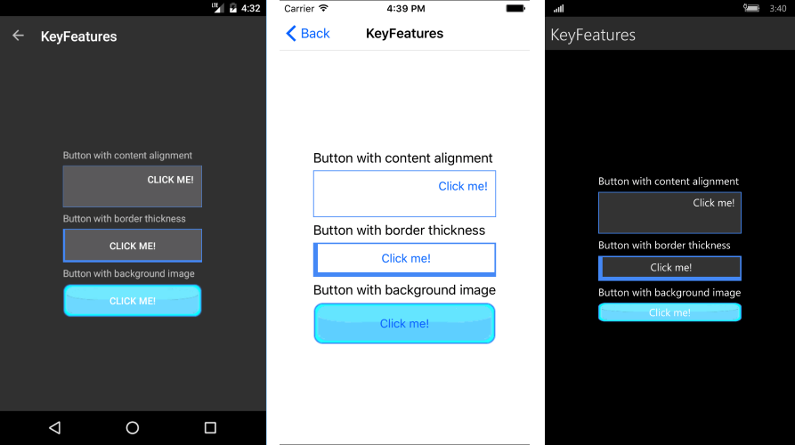

# Key Features

The purpose of this help article is to show you the key features of the **RadButton** control. 

## Content Alignment

RadButton exposes **HorizontalContentAlignment** and **VerticalContentAlignment** properties of type Xamarin.Forms.TextAlignment which you can use to set different positioning of its content. 

Here is a quick example how you can apply these:

<snippet id='button-features-contentalignment'/>

Where:

<snippet id='xmlns-telerikinput'/>

## Border Thickness

The **BorderThickness** property is of type Xamarin.Forms.Thickness and is used to set the borders’ width.  Type Thickness gives you the option to define different border on each side of the Button.

The snippet below demonstrates how BorderThickness could be defined.

<snippet id='button-features-borderthickness'/>

## Background Image

The **BackgroundImage** property is of type ImageSource and is used to set a graphic as a background of the RadButton control.   

The next snippet shows how you can apply the background image.

<snippet id='button-features-backgroundimage'/>

>In the example buttonBackground.png image is located in each of the application projects (Resources folder in iOS, Resources/Drawable folder in Android, and application root in UWP; each with the appropriate build action set). You can read more on loading and displaying images in Xamarin.Forms here:  [Xamarin.Forms -> User Interface-> Images](https://developer.xamarin.com/guides/xamarin-forms/user-interface/images/#Local_Images).

Here is the end result:

## See Also

- [Circular Button]()
- [Button with disabled text color]()
