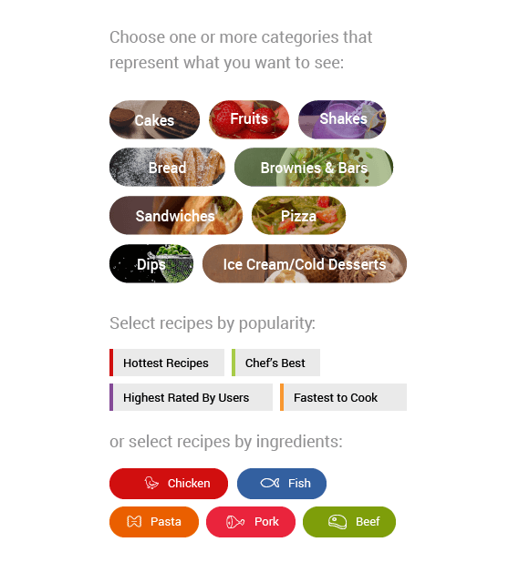

# Overview

**Telerik Button for Xamarin** is a button control, which enhances the functionality of the standard Xamarin Forms Button, by providing means for customizing its look &amp; feel. UI customization is possible through the provided theme or you can add borders,  transparency, text alignment, and backgrounds and images. 

## Key features

 * **Content alignment options**: With RadButton you will be able to apply different horizontal and vertical positioning of its content, for more details on this go to [Key Features: Content Alignment](#content-alignment) section from RadButton's documentation.
 
 * **Setting border thickness**: RadButton provides a **BorderThickness** property which you can use together with **BorderColor** in order to have various types of borders around your buttons, check [Key Features: Border Thickness](#border-thickness) for more information on this.
 
 * **Setting background image**: You can customize the appearance of RadButton by applying am image as its background, read [Key Features: Background Image](#background-image) topic for detailed information on this.
 
 * **Creating circle button**: You will be able to create a circular button by adjusting the Width, Height and BorderRadius of RadButton, check [How To: Create Circle Button] () topic for more details.
 
 * **Theming support**: RadButton comes with built-in theming support that helps you achieve consistent look with the rest controls from Telerik UI for Xamarin suite. To learn more about this go to [Theme Overview]().
 
>tip Check out RadButton [Getting Started]() help article that shows how to use it in a basic scenario.

## See Also

- [Key Features]()
- [Create Circle Button]()