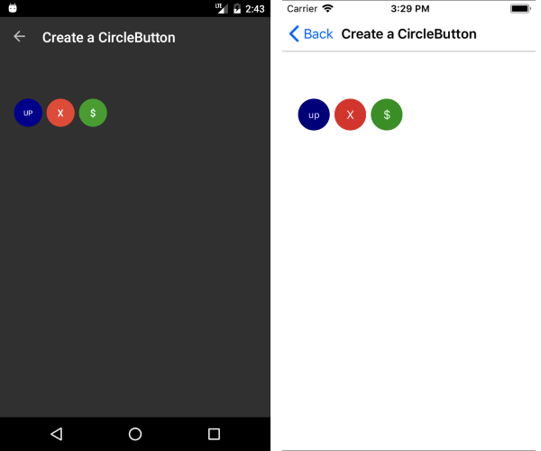

# Create Circle Button

&nbsp;

You could easily create circular buttons with RadButton by adjusting its Width, Height and BorderRadius properties following the next instructions:

* Width should be equal to Height;
* BorderRadius should be set to half Width/Height value;

> In some cases, you may need to set a BorderWidth value in order for BorderRadius to take effect.

Here is a quick example:

<snippet id='button-circular-xaml'/>

Appearance of different circular buttons:

## See Also

- [Button Getting Started]()
