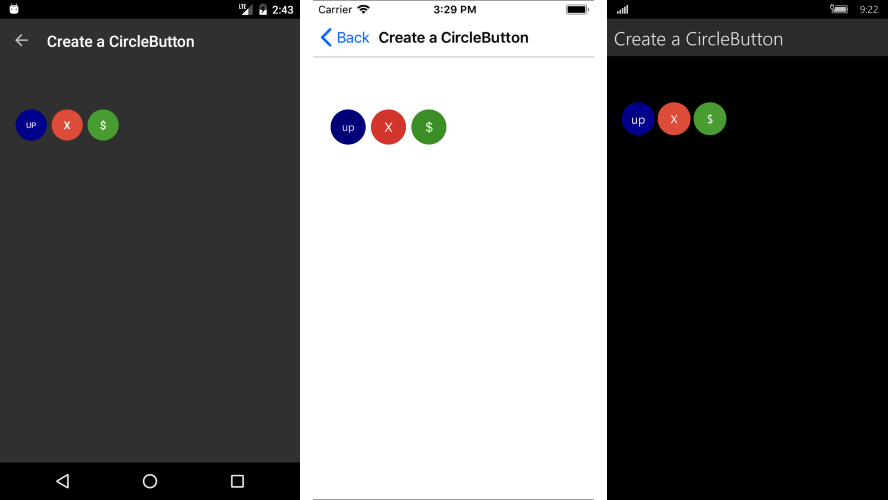

# Create Circle Button

&nbsp;

You could easily create circular Buttons with RadButton by adjusting its Width, Height and BorderRadius properties following the next instructions:

* Width should be equal to Height;
* BorderRadius should be set to half Width/Height value;

Here is a quick example:

	<telerikInput:RadButton WidthRequest="40" 
							HeightRequest="40"                                
							Text="up" 
							FontSize="Micro" 
							TextColor="White" 
							BackgroundColor="DarkBlue" 
							BorderRadius="20"  />

And the end result:

## See Also

- [Button Getting Started]()
