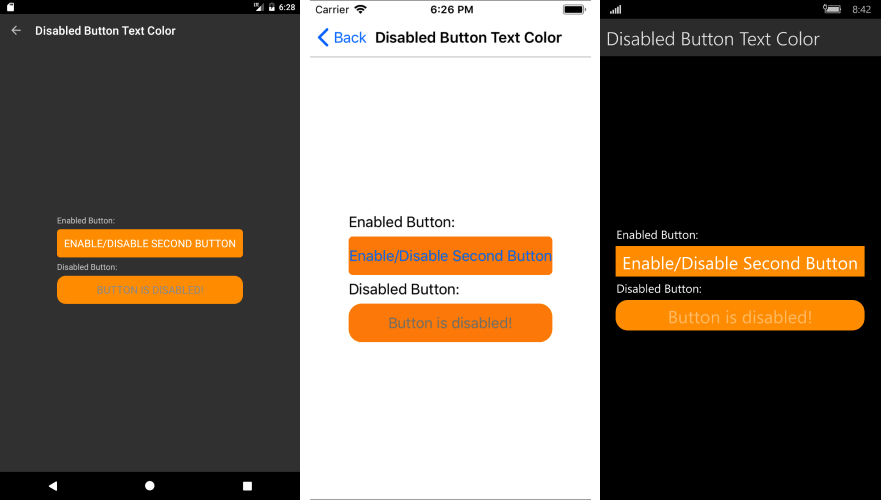

# Set TextColor for Disabled RadButton

You can set text color when the button is enabled/disabled using a Style or Custom Renderer.

## Using Style

```XAML
<Style x:Key="ButtonStyle"
       TargetType="telerikInput:RadButton">
<Style.Triggers>
    <Trigger TargetType="telerikInput:RadButton" Property="IsEnabled" Value="True">
		<Setter Property="TextColor" Value="Black" />
        <Setter Property="BackgroundColor" Value="Gray" />
    </Trigger>
    <Trigger TargetType="telerikInput:RadButton" Property="IsEnabled" Value="False">
        <Setter Property="TextColor" Value="White" />
        <Setter Property="BackgroundColor" Value="LightGray" />
    </Trigger>
</Style.Triggers>
</Style>
```

and the Button definition:

```XAML
<input:RadButton Style="{StaticResource ButtonStyle}"
                 x:Name="Button"
                 Text="TelerikXamarinButton"/>
```

## Custom Renderer Approach

You can create custom renderers for the different platforms and set the color directly on the native elements. This article will guide you on how to achieve the behavior on the different platforms.

**1.** As a first step, in order to use a custom renderer for the RadButton, you should create a custom class that inherits from RadButton. Eventually, you can target your custom element within the custom renderer.

Here is the custom class:

<snippet id='button-custom-class-renderer-cs'/>

And how it is declared within your page:

<snippet id='button-disabled-text-color-xaml'/>

**2.** Once you have added the 'custom' control to your application, you can create the following custom renderers for the different platforms in order to alter the TextColor when the button is disabled:

### iOS Renderer

<snippet id='button-disabled-text-color-iosrenderer-cs'/>

### Android Renderer

<snippet id='button-disabled-text-color-androidrenderer-cs'/>

### UWP Renderer

<snippet id='button-disabled-text-color-uwprenderer-cs'/>

**Figure 1** shows the appearance of the disabled RadButton once the custom renderers have been added to your application.

#### Figure 1: Text Color of disabled RadButton



## See Also

- [Button Getting Started]()
- [Circular Button]()
