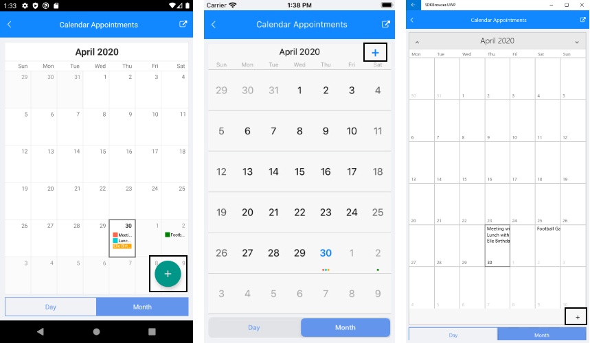

# Add Appointment Button

With R2 2020 Release of Telerik UI for Xamarin RadCalendar control provides you the option to add appointments using the calendar's **Add Appointment Button**. By default the add appointment button is not visible. In order to display it on the screen you need to use the following porperty:

* **IsAddAppointmentVisible**(*bool*): Specifies whether the add appointment button will be visible. If you want to add appointments using the button you need to set the **IsAddAppointmentVisible** to **True**.

<snippet id='calendar-appointments-example'/>

* In addition the add appointment button has an event **AddAppointmentButtonClicked** which occurs when the Button within the Calendar is tapped. Telerik.XamarinForms.Input.IsAddAppointmentButtonVisible controls the visibility of the button.

<snippet id='calendar-appointment-button-click-event'/>

The image below shows where is the button position when IsAddAppointmentVisible="True":

## See Also

* [View Modes]()
* [Day View]()
* [MultiDay View]()
* [Agenda View]()
* [Recurrence]()
* [Calendar Selection]()

