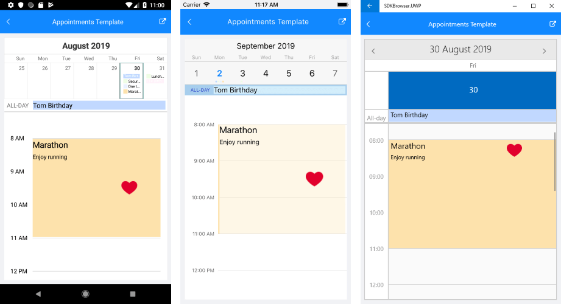

# Appointment Template for Calendar for Xamarin

With R3 2019 Release of Telerik UI for Xamarin RadCalendar control provides the option to apply a **ContentTemplate** to the **Appointments** for **DayView** and **MultiDayView**. You could easily set a Template or TemplateSelector to the appointments through the **AppointmentContentTemplate** property of the DayViewSettings or MultiDaySettings.

* **AppointmentContentTemplate** (*DataTemplate*): Defines the DataTemplate of the Appointment based on the data object.

## Appointment Template in DayView and MultiDayView

## Appointment Template Example

The following example shows how to set AppointmentContentTemplate in DayView Mode using DataTemplateSelector.

First, create a ViewModel class with a collection of Appointment objects:

<snippet id='calendar-appointments-template-viewmodel'/>

Create a custom appointment template selector class which inherits from DataTemplateSelector and override the OnSelectTemplate method:

<snippet id='calendar-appointments-template-selector-class'/>

Add the created DayViewAppointmentTemplateSelector as a Resource and define both DataTemplates:

<snippet id='calendar-appointments-template-selector'/>

Finally, set the AppointmentContentTemplate property of the DayViewSettings:

<snippet id='calendar-appointments-template-example'/>

Here is the result:

>important [SDK Browser application](https://docs.telerik.com/devtools/xamarin/sdk-browser-overview#sdk-browser-application) contains a sample Appointments Template example. You can find it in the **Calendar &amp; Scheduling /Features** folder.

## See Also

* [View Modes]()
* [Day View]()
* [MultiDay View]()
* [Agenda View]()
* [Recurrence]()
* [Calendar Selection]()
