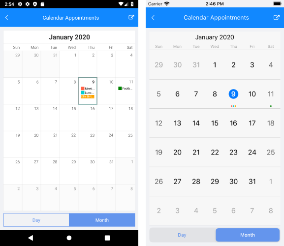
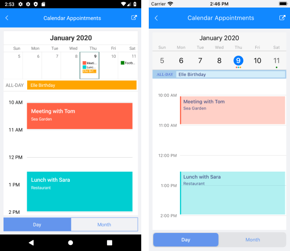

# Appointments #

## Creating an Appointment ##

RadCalendar can display appointments by setting its **AppointmentsSource** property. It accepts a collection of objects which should implement *Telerik.XamarinForms.Input.IAppointment* interface. This interface defines the following members:

- **StartDate** *(DateTime)*
- **EndDate** *(DateTime)*
- **Title** *(string)*
- **Detail** *(string)*
- **Color** *(Color)*
- **IsAllDay** *(bool)*
- **RecurrenceRule** *(RecurrenceRule)*

>note In R1 2019 we have added RecurrenceRule property to the *IAppointment* interface in order to support recurrent appointments. For more details on this check [RecurrenceRule]() topic.

With R1 2019 release of Telerik UI for Xamarin we have introduced **Appointment** class, which implements the *IAppointment* interface, so you could directly use it to create appointments.

<snippet id='calendar-gettingstarted-appointmentssource-csharp'/>

#### **Figure 1: Appearance of the RadCalendar control in month view mode**

#### **Figure 2: Appearance of the RadCalendar control in day view mode**

## Events ##
 
**AppointmentTapped**(AppointmentTappedEventArgs): Occurs when you tap over a specific appointment when in DayView or MultiDayView mode. It can be used to get all the information regarding the appointment.

### AppointmentTapped Example ###

First you need to set the ViewMode to Day:

<snippet id='calendar-features-setviewmode-csharp'/>

Eventually, you can utilize the event: 

<snippet id='calendar-features-appointmenttapped-csharp'/>

## See Also

* [View Modes]()
* [Calendar Selection]()

