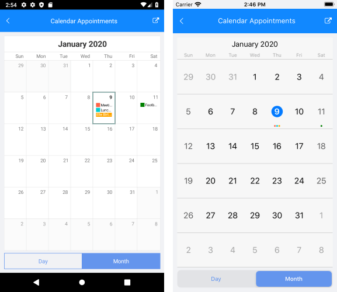

# Appointments

## Creating an Appointment

RadCalendar can display appointments by setting its **AppointmentsSource** property. AppointmentsSource accepts a collection of *Telerik.XamarinForms.Input.Appointment* objects. Each Appointment defines the following members:

- **StartDate** (*DateTime*);
- **EndDate** (*DateTime*);
- **Title** (*string*): sets the subject of the appointment;
- **Detail** *(string)*: adds additional information related to the appointment;
- **Color** *(Color)*: : specifies the color marking the appointment when visualized in the timeline; 
- **IsAllDay** (*bool*): indicates whether the appointment will take all day;
- **RecurrenceRule** (*IRecurrenceRule*): defines basic properties of the recurrence rule of the appointment, for more details go to [Recurrence]() topic.

The other alternative is to create custom appointment class that implements the *Telerik.XamarinForms.Input.IAppointment* interface. The interface, however, misses the RecurrenceRule property, so we'd recommend you use directly the **Appointment** class when working with appointments.

Here is a quick example on how you can create Appointments collection and bind it to the **AppointmentsSource** property of RadCalendar.

First, create a ViewModel class and add "Appointments" collection inside it:

<snippet id='calendar-appointments-viewmodel'/>

Then, add the RadCalendar definition to your page:

<snippet id='calendar-appointments-example' />

#### **Figure 1: Appearance of the RadCalendar control in month view mode**

#### **Figure 2: Appearance of the RadCalendar control in day view mode**

## Add Appointment Button

With R2 2020 Release of Telerik UI for Xamarin RadCalendar control provides you the option to add appointments using the calendar's **Add Appointment Button**. By default the add appointment button is not visible. In order to display it on the screen you need to use the following porperty:

* **IsAddAppointmentVisible**(*bool*): Specifies whether the add appointment button will be visible. If you want to add appointments using the button you need to set the **IsAddAppointmentVisible** to **True**.

<snippet id='calendar-appointments-example'/>

* In addition the add appointment button has an event **AddAppointmentButtonClicked** which occurs when the Button within the Calendar is tapped. Telerik.XamarinForms.Input.IsAddAppointmentButtonVisible controls the visibility of the button.

<snippet id='calendar-appointment-button-click-event'/>

The image below shows where is the button position when IsAddAppointmentVisible="True":

## Appointment Template

With R3 2019 Release of Telerik UI for Xamarin RadCalendar control provides the option to apply a **ContentTemplate** to the **Appointments** for **DayView** and **MultiDayView**. You could easily set a Template or TemplateSelector to the appointments through the **AppointmentContentTemplate** property of the DayViewSettings or MultiDaySettings.

* **AppointmentContentTemplate** (*DataTemplate*): Defines the DataTemplate of the Appointment based on the data object.

#### Appointment Template in DayView and MultiDayView

### Appointment Template Example

The following example shows how to set AppointmentContentTemplate in DayView Mode using DataTemplateSelector.

First, create a ViewModel class with a collection of Appointment objects:

<snippet id='calendar-appointments-template-viewmodel'/>

Create a custom appointment template selector class which inherits from DataTemplateSelector and override the OnSelectTemplate method:

<snippet id='calendar-appointments-template-selector-class'/>

Add the created DayViewAppointmentTemplateSelector as a Resource and define both DataTemplates:

<snippet id='calendar-appointments-template-selector'/>

Finally, set the AppointmentContentTemplate property of the DayViewSettings:

<snippet id='calendar-appointments-template-example'/>

Here is the result:

>important [SDK Browser application](https://docs.telerik.com/devtools/xamarin/sdk-browser-overview#sdk-browser-application) contains a sample Appointments Template example. You can find it in the **Calendar &amp; Scheduling /Features** folder.

## Events
 
**AppointmentTapped**(AppointmentTappedEventArgs): Occurs when you tap over a specific appointment when in DayView or MultiDayView mode. It can be used to get all the information regarding the appointment.

### AppointmentTapped Example

First you need to set the ViewMode to Day:

<snippet id='calendar-features-setviewmode-csharp'/>

Eventually, you can utilize the event: 

<snippet id='calendar-features-appointmenttapped-csharp'/>

## See Also

* [View Modes]()
* [Day View]()
* [MultiDay View]()
* [Agenda View]()
* [Recurrence]()
* [Calendar Selection]()

