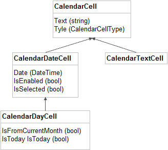

## CalendarCell ##

- **Text** (string): Gets the text displayed in the cell.
- **Type** (CalendarCellType): Gets the type of the cell.

## CalendarDateCell : CalendarCell ##

- **IsEnabled** (bool): Gets a value that specifies whether the cell is enabled (inside the calendar MinDate and MaxDate range).
- **IsSelected** (bool): Gets a value that specifies whether the cell is currently selected.
- **Date** (DateTime): Gets the date that corresponds to the cell.

>**Type**: The only allowed type of CalendatDayCell is `Date`.

## CalendatDayCell : CalendarDateCell ##

- **IsFromCurrentMonth** (bool): Gets a value that specifies whether the cell is from the current month in month view.
- **IsToday** (bool): Gets a value that specifies whether the cell date is today.

>**Type**: The only allowed type of CalendatDayCell is `Date`.

## CalendarTextCell : CalendarCell ##

>**Type**: The only allowed types of CalendatDayCell are `Title`, `WeekNumber` and `DayName`.
