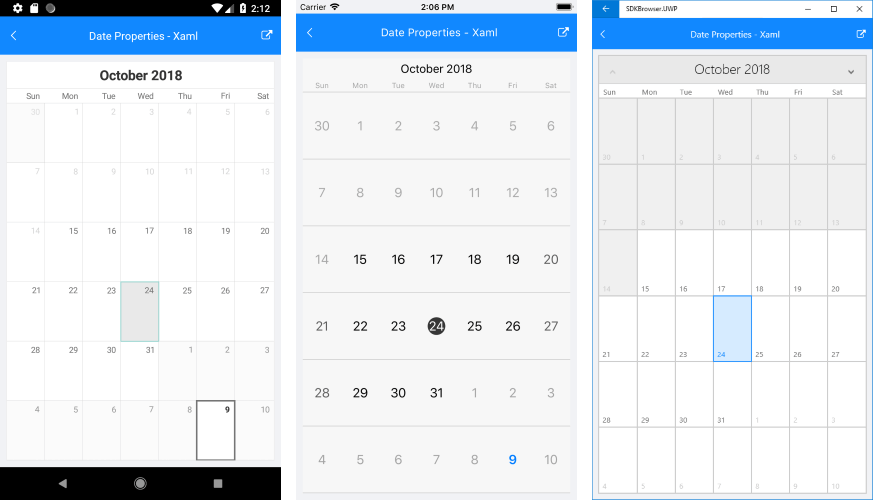

# Date Properties

This article lists the date properties you could use to configure **RadCalendar** control.

## Setting the current Display Date

**DisplayDate** property allows you to set the current visible date. This is the date which will be displayed when you show the calendar. Depending on the current ViewMode, DisplayDate defines which day, month, week or year to be shown in RadCalendar. By default DisplayDate is DateTime.Today.

## Constraining visible Dates

You could restrict the visible/selectable dates in RadCalendar by utilizing **MinDate** and **MaxDate** properties. By applying MinDate and MaxDate you can prevent navigating the calendar view to a date outside of the defined date range.

>note If dates outside of the MinDate-MaxDate range are in the currently visible view, they will look disabled.

## Selecting a Date

**SelectedDate** property holds the currently selected date, *null* means that no date is selected. For more details on the selection functionality, refer to [Selection]() topic.

## Example

Here is a quick example to demonstrate how Date properties of RadCalendar would work:

<snippet id='calendar-dateproperties-xaml'/>
<snippet id='calendar-dateproperties-csharp'/>

And the result on different platforms is shown below:

## See Also

* [View Modes]()
* [Calendar Selection]()
