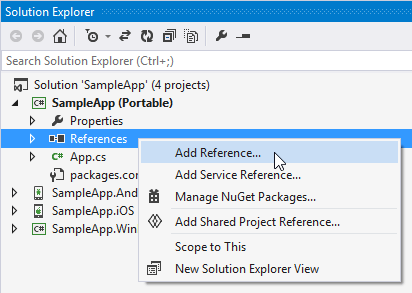
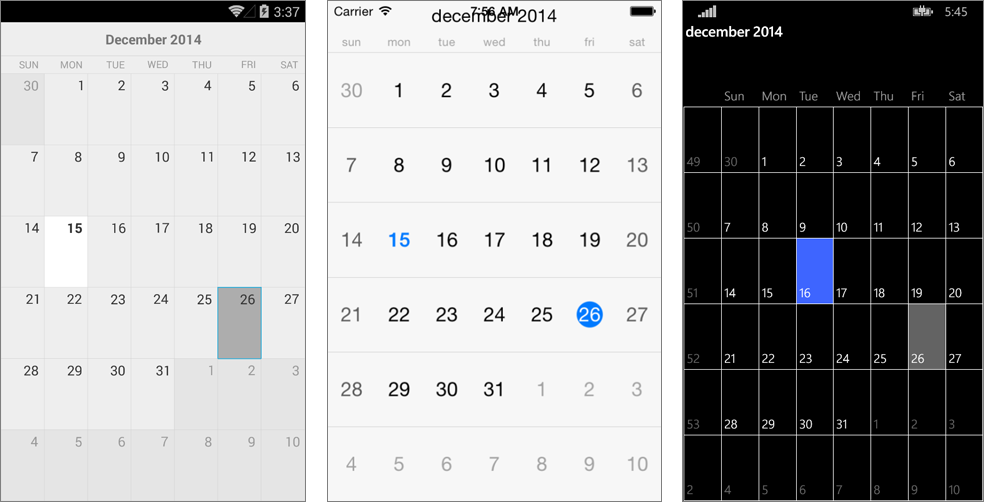

# Getting Started #

This example will guide you through the steps needed to add a basic RadCalendar control in your application.

## Add References to Telerik UI for Xamarin.Forms ##

First you have to create a new Xamarin.Forms project. You can see how in the [Getting Started Example]( "Getting Started with Telerik UI for Xamarin.Forms"). Then you have to add reference to the following assemblies:

* **Portable** (if you have created Xamarin.Forms Portable App)
	- Telerik.XamarinForms.Input.dll
	- Telerik.XamarinForms.Common.dll
* **Android**
	- Telerik.Xamarin.Android.Input.dll
	- Telerik.Xamarin.Android.Common.dll
	- Telerik.Xamarin.Android.Primitives.dll
	- Telerik.XamarinForms.Input.dll
	- Telerik.XamarinForms.InputRenderer.Android.dll
	- Telerik.XamarinForms.Common.dll
* **iOS**
	- Telerik.Xamarin.iOS.dll
	- Telerik.XamarinForms.Input.dll
	- Telerik.XamarinForms.InputRenderer.iOS.dll
	- Telerik.XamarinForms.Common.dll
* **WinPhone**
	- Telerik.Windows.Controls.Input.dll
	- Telerik.Windows.Controls.Primitives.dll
	- Telerik.Windows.Core.dll
	- Telerik.XamarinForms.Input.dll
	- Telerik.XamarinForms.InputRenderer.WinPhone.dll
	- Telerik.XamarinForms.Common.dll

## NuGet Packages
Next step is to add references to the NuGet Packages needed by RadRadCalendar in the Android project. You can find the full list with required packages in the - [**Required Android Support Libraries**]() help topic.
	
You will have to add the following code to these project files:

* **Android**: MainActivity.cs
  
		[assembly: Xamarin.Forms.ExportRenderer(typeof(Telerik.XamarinForms.Input.RadCalendar), typeof(Telerik.XamarinForms.InputRenderer.Android.CalendarRenderer))]

* **iOS**: AppDelegate.cs

		[assembly: Xamarin.Forms.ExportRenderer(typeof(Telerik.XamarinForms.Input.RadCalendar), typeof(Telerik.XamarinForms.InputRenderer.iOS.CalendarRenderer))]

	You also have to create the following instance in the `FinishedLaunching()` method before the `Forms.Init()` call:

		new Telerik.XamarinForms.InputRenderer.iOS.CalendarRenderer();

* **WinPhone**: MainPage.xaml.cs
    
		[assembly: Xamarin.Forms.ExportRenderer(typeof(Telerik.XamarinForms.Input.RadCalendar), typeof(Telerik.XamarinForms.InputRenderer.WinPhone.CalendarRenderer))]

##Add Calendar Control to Your Project##

1. Add new Xamarin.Forms page to your Portable/Shared project:
	* **Visual Studio**: right click on the project > `Add` > `New Item...` > choose `Forms Xaml Page`
	* **Xamarin Studio**: right click on the project > `Add` > `New File` > choose `Forms ContentPage Xaml`

1. Modify the GetMainPage() method in the App.xaml.cs file to set the newly created page as a front page of the application:

		public class App
		{
			public static Page GetMainPage()
			{
				return new MainPage();
			}
		}

1. Edit the MainPage.xaml file to add a RadCalendar control:

	    <telerikInput:RadCalendar/>
where:  

		 xmlns:telerikInput="clr-namespace:Telerik.XamarinForms.Input;assembly=Telerik.XamarinForms.Input"
Alternatively, you can add the calendar in code behind:

		public partial class MainPage
	    {
	        public MainPage()
	        {
	            InitializeComponent();
	            
				this.Content = new RadCalendar();
	        }
		}

Here is the result:  
