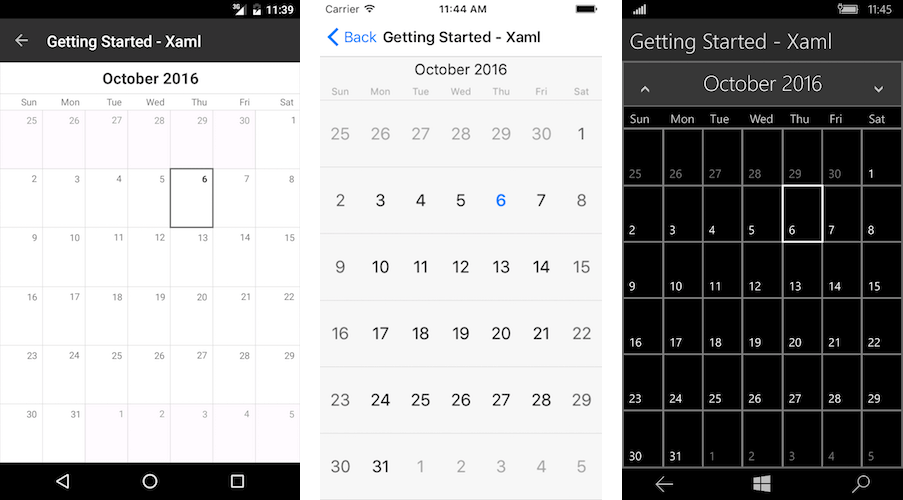

# Getting Started
   
This example will guide you through the steps needed to add a basic **RadCalendar** control in your application.

* [Setting up the app](#1-setting-up-the-app)
* [Adding the required Telerik references](#2-adding-the-required-telerik-references)
* [Adding RadCalendar control](#3-adding-radcalendar-control)

## 1. Setting up the app

Take a look at these articles and follow the instructions to setup your app:

- [Setup app with Telerik UI for Xamarin on Windows]()
- [Setup app with Telerik UI for Xamarin on Mac]()

## 2. Adding the required Telerik references

You have two options:

* Add the Telerik UI for Xamarin Nuget package following the instructions in [Telerik NuGet package server]() topic.

If you don't want to add the all Telerik.UI.for.Xamarin nuget package, you have the option to add a separate nuget package. For RadCalendar control you have to install the **Telerik.UI.for.Xamarin.Input** nuget package. This nuget will automatically refer the Telerik.UI.for.Xamarin.Primitives, Telerik.UI.for.Xamarin.Common, and Telerik.UI.for.Xamarin.DataControls nuget packages.

* Add the references to Telerik assemblies manually, check the list below with the required assemblies for **RadCalendar** component:

| Platform          | Assemblies |
| ----------------- | ---------- |
| Portable          | Telerik.XamarinForms.Common.dll Telerik.XamarinForms.Input.dll |
| Android           | Telerik.Xamarin.Android.Common.dll Telerik.Xamarin.Android.Data.dll  Telerik.Xamarin.Android.Input.dll Telerik.Xamarin.Android.List.dll  Telerik.Xamarin.Android.Primitives.dll Telerik.XamarinForms.Common.dll Telerik.XamarinForms.Input.dll |
| iOS               | Telerik.Xamarin.iOS.dll Telerik.XamarinForms.Common.dll Telerik.XamarinForms.Input.dll |
| UWP               | Telerik.Core.dll Telerik.Data.dll Telerik.UI.Xaml.Controls.Data.UWP.dll  Telerik.UI.Xaml.Input.UWP.dll  Telerik.UI.Xaml.Primitives.UWP.dll  Telerik.XamarinForms.Common.dll  Telerik.XamarinForms.Input.dll |

## 3. Adding RadCalendar control

You could use one of the following approaches:

#### Drag the control from the Toolbox. 

Take a look at the following topics on how to use the toolbox:

* [Telerik UI for Xamarin Toolbox on Windows]()
	
#### Create the control definition in XAML or C#.

The snippet below shows a simple RadCalendar definition:

<snippet id='calendar-gettingstarted-xaml'/>
<snippet id='calendar-gettingstarted-csharp'/>

In addition to this, you need to add the following namespace:

<snippet id='xmlns-telerikinput'/>
<snippet id='ns-telerikinput'/>

> RadCalendar control requires its visual parent to provide vertical or horizontal space for the control to fill into. Please avoid placing the control inside ScrollView as the calendar control has its own scrolling.

Here is the result:

>important **SDK Browser** and **QSF** applications contain different examples that show RadCalendar's main features. You can find the applications in the **Examples** and **QSF** folders of your local **Telerik UI for Xamarin** installation.

## See Also

- [Visual Structure]()
- [Navigation and View Mode]()
- [Selection]()