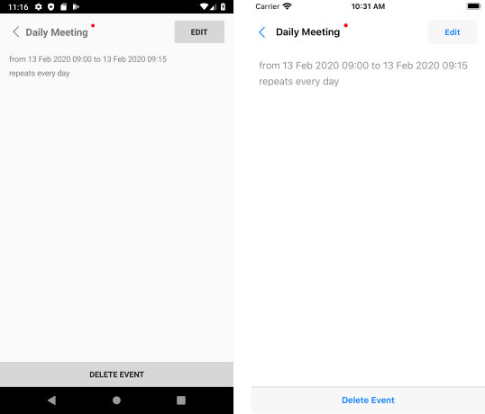
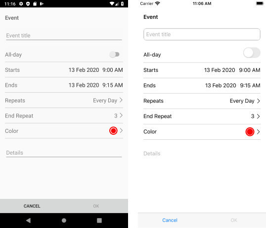
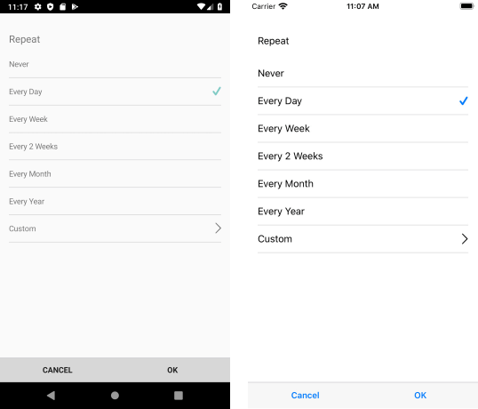
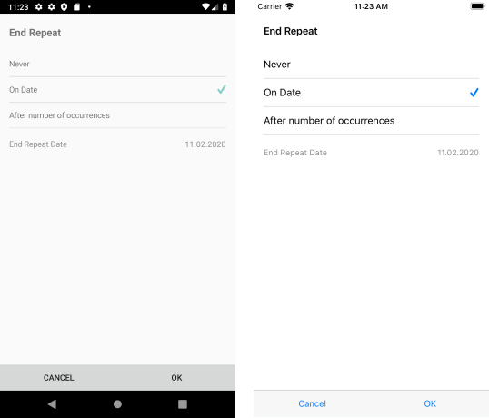
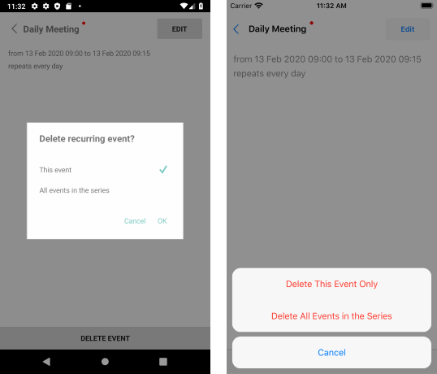
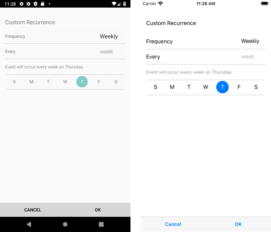

# Localization

RadCalendar for Xamarin provides language localization. In short, you can translate the used across the Calendar & Scheduling UI texts and phrases to other languages, so that your app can be adapted to different regions.

>important To learn in details about the localization process of Telerik UI for Xamarin components, please go through the common [Localization and Globalization]() topic.

The sections below list all the localization keys used in RadCalendar grouped by the views they appear in.

## Calendar Views Localization Keys

| Localization Key | Default Value | Refers to |
| -----------------| ------------- |----------- |
| Calendar_AppointmentAllDay  | All-day | All-day appointments label in DayView and MultiDayView |
| Calendar_AgendaAllDay  | All-Day | All-day appointments label in AgendaView |
| Calendar_AgendaStartTimeText  | Starts | Multi-day appointments that have Start and End times (so they are not all-day) |
| Calendar_AgendaEndTimeText  | Ends | Multi-day appointments that have Start and End times (so they are not all-day) |

Check in the image below how the localization strings are presented in AgendaView:

## Scheduling UIs Localization Keys

The next localization keys are related to RadCalendar [Scheduling UIs](). These include built-in screens for creating and modifying appointments, including applying recurrence rules.

#### Edit/Delete Existing Appointment Screen

| Localization Key | Default Value |
| -----------------| ------------- |
| Calendar_EditButton  | Edit |
|Calendar_DeleteButton  | Delete Event |

#### Create/Edit Appointment Screen

| Localization Key | Default Value |
| -----------------| ------------- |
| Calendar_AppointmentEventTitle  | Event |
|Calendar_EditEventTitle  |	Event Title |
| Calendar_AppointmentStarts  | Starts |
| Calendar_AppointmentEnds  | Ends |
| Calendar_AppointmentRepeats  | Repeats |
| Calendar_AppointmentEndRepeats  | End Repeat |
| Calendar_AppointmentColor  | Color |
| Calendar_ColorPickerTitle  | Color |
| Calendar_DetailsEditorPlaceholderText  | Details | 
| Calendar_AppointmentOKButton  | OK |
| Calendar_AppointmentCancelButton  | Cancel |

#### Repeat Options Screen

| Localization Key | Default Value |
| -----------------| ------------- |
| Calendar_RepeatTitle  | Repeat |
| Calendar_AppointmentRepeatOptionsNever  | Never |
| Calendar_AppointmentRepeatOptionsEveryDay  | Every Day |
| Calendar_AppointmentRepeatOptionsEveryWeek  | Every Week |
| Calendar_AppointmentRepeatOptionsEvery2Weeks  | Every 2 Weeks |
| Calendar_AppointmentRepeatOptionsEveryMonth  | Every Month |
| Calendar_AppointmentRepeatOptionsEveryYear  | Every Year |
| Calendar_AppointmentRepeatOptionsCustom  | Custom |

#### End Repeat Screen

| Localization Key | Default Value |
| -----------------| ------------- |
| Calendar_EndRepeatLabel  |	End Repeat Date |
| Calendar_EndRepeatOptionsAfter  |	After number of occurrences |
| Calendar_EndRepeatOptionsNever  | Never |
| Calendar_EndRepeatOptionsOnDate  | On Date |
| Calendar_EndRepeatTitle  | End Repeat |
| Calendar_OccurencesLabel  | Number of occurrences |

#### Delete Appointment Screen

| Localization Key | Default Value |
| -----------------| ------------- |
| Calendar_Android_DeleteRecurringEventTitle | Delete recurring event? |
| Calendar_Android_DeleteSeries  | All events in the series |
| Calendar_Android_DeleteSingleEvent  | Delete this event? |
| Calendar_Android_DeleteSingleRecurringEvent | This event |
| Calendar_DeleteSingleEventAndroid  | Delete this event? |
| Calendar_iOS_DeleteSeries  | Delete All Events in the Series |
| Calendar_iOS_DeleteSingleEvent  | Delete event |
| Calendar_iOS_DeleteSingleRecurringEvent  | Delete This Event Only |

#### Save Appointment Screen

| Localization Key | Default Value |
| -----------------| ------------- |
| Calendar_Android_SaveRecurringEventTitle  | Save recurring event? |
| Calendar_Android_SaveSeries  | All events in the series |
| Calendar_Android_SaveSeriesNotification  | The changes will be applied to all events in the series |
| Calendar_Android_SaveSingleRecurringEvent  | This event |
| Calendar_iOS_SaveSeries  | Save All Events in the Series 

#### Custom Recurrence Screens

| Localization Key | Default Value |
| -----------------| ------------- |
| Calendar_CustomRecurrenceTitle  | Custom Recurrence |
| Calendar_CustomRecurrenceFrequency  | Frequency |
| Calendar_CustomReccurence_FrequencyPickerTitle_Day  | Day |
| Calendar_CustomReccurence_FrequencyPickerTitle_Month  | month |
| Calendar_CustomReccurence_FrequencyPickerTitle_Week  | week |
| Calendar_CustomReccurence_FrequencyPickerTitle_Year  | year |
| Calendar_CustomReccurenceAdditionalOptions_Each  | Each |
| Calendar_CustomReccurenceAdditionalOptions_OnThe  | On the...|
| Calendar_CustomReccurenceMessage_DotCharacter  | . |
| Calendar_CustomReccurenceMessage_First  | Event will occur every |
| Calendar_CustomReccurenceMessage_In  | in |
| Calendar_CustomReccurenceMessage_MonthIndexFifth  | 5th |
| Calendar_CustomReccurenceMessage_MonthIndexFirst  |1st |
| Calendar_CustomReccurenceMessage_MonthIndexFourth  | 4th |
| Calendar_CustomReccurenceMessage_MonthIndexLast  | last |
| Calendar_CustomReccurenceMessage_MonthIndexSecond  | 2nd |
| Calendar_CustomReccurenceMessage_MonthIndexThird  | 3rd |
| Calendar_CustomReccurenceMessage_On  | on |
| Calendar_CustomReccurenceMessage_Prefix  | on the |
| Calendar_CustomReccurenceMessage_Suffix  |	s |
| Calendar_CustomRecurrenceEvery  | Every |
| Calendar_FrequencyOptionsDaily  | Daily |
| Calendar_FrequencyOptionsMonthly  | Monthly |
| Calendar_FrequencyOptionsWeekly  | Weekly |
| Calendar_FrequencyOptionsYearly  | Yearly |
| Calendar_MonthFrequencyFifth  | Fifth |
| Calendar_MonthFrequencyFirst  | First |
| Calendar_MonthFrequencyFourth  | Fourth |
| Calendar_MonthFrequencyLast  | Last |
| Calendar_MonthFrequencySecond  | Second |
| Calendar_MonthFrequencyThird  | Third |

#### Days/Months Names

| Localization Key | Default Value |
| -----------------| ------------- |
| Calendar_AdditionalInfoMonthDay	| Day |
| Calendar_AdditionalInfoMonthFriday | Friday |
| Calendar_AdditionalInfoMonthMonday	| Monday	| 
| Calendar_AdditionalInfoMonthSaturday | Saturday |
| Calendar_AdditionalInfoMonthSunday | Sunday |
| Calendar_AdditionalInfoMonthThursday  | Thursday |
| Calendar_AdditionalInfoMonthTuesday  | Tuesday |
| Calendar_AdditionalInfoMonthWednesday  | Wednesday |
| Calendar_AdditionalInfoMonthWeekday  | Weekday |
| Calendar_AdditionalInfoMonthWeekendDay  | Weekend Day |
| Calendar_MonthAbbreviationApril  | Apr |
| Calendar_MonthAbbreviationAugust  | Aug |
| Calendar_MonthAbbreviationDecember  | Dec |
| Calendar_MonthAbbreviationFebruary  | Feb |
| Calendar_MonthAbbreviationJanuary  | Jan |
| Calendar_MonthAbbreviationJuly  | Jul |
| Calendar_MonthAbbreviationJune  | Jun |
| Calendar_MonthAbbreviationMarch  | Mar |
| Calendar_MonthAbbreviationMay  | May |
| Calendar_MonthAbbreviationNovember  | Nov |
| Calendar_MonthAbbreviationOctober  | Oct |
| Calendar_MonthAbbreviationSeptember  | Sep |
| Calendar_WeekDayAbbreviationFriday  |	F |
| Calendar_WeekDayAbbreviationMonday  | M |
| Calendar_WeekDayAbbreviationSaturday  | S |
| Calendar_WeekDayAbbreviationSunday  | S |
| Calendar_WeekDayAbbreviationThursday  | T |
| Calendar_WeekDayAbbreviationTuesday  | T |
| Calendar_WeekDayAbbreviationWednesday | W | 

## See Also

* [Localization and Globalization]()
* [View Modes]()
* [Agenda View]()
* [Scheduling UIs]()
