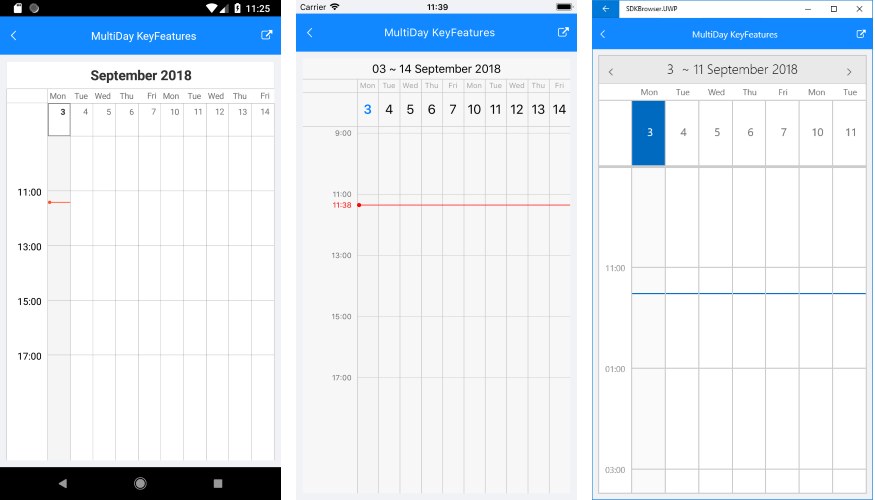
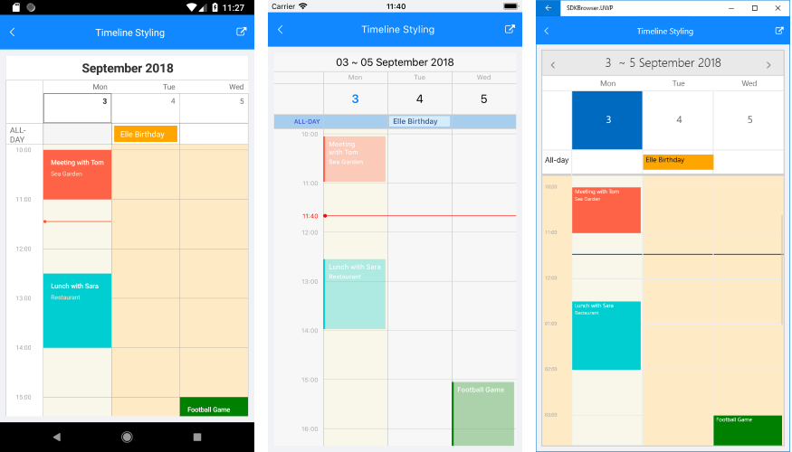

# MultiDay View #

With R3 2018 release RadCalendar comes with new MultiDay view mode which enables you to create a detailed view of the schedule for a specific day (or days). In addition, you will have full control over the way the MultiDay view is visualized through various configuration options such as day start and end times, timeline settings, current time indicator, and more.

The main purpose of the MultiDay view is to display appointments to the end-users in a convenient way. For more details on the Appointments feature of RadCalendar refer to [Appointments]() topic.

## Key Features

This section lists the key properties of the MultiDay ViewMode so you could configure it to best suit your needs.

* **VisibleDays**: Defines the number of days visualized on the view area. The default is 7 days. 
* **DayStartTime**: Defines the time used to indicate the start of the timeline. The default value of the DayStartTime is 00:00:00 or 12:00 AM. 
* **DayEndTime**: Sets the time used to indicate the end of the timeline.
* **WeekendsDisplayMode**: It is of type *Telerik.XamarinForms.Common.DisplayMode* and will allow you to exclude the weekends from the timeline, so that only the work week is displayed.
* **TimelineInterval**: This property is of type *TimeSpan* and defines the time intervals inside the timeline.
* **CurrentTimeIndicatorDisplayMode**: It is of type *Telerik.XamarinForms.Common.DisplayMode* and provides the option to visually mark the current time. In addition, you could customize the way the current time indicator looks through a few styling properties, for more details go to Styling section.

All of the above are applied using the **MultiDayViewSettings** property of RadCalendar. Here is a quick example on how they could be set:

<snippet id='calendar-scheduling-keyfeatures'/>

The next image shows MultiDay view with the MultiDayViewSettings applied:

## Work Week Support

By setting **IsWeekendVisible** property through MultiDayViewSettings of RadCalendar, you can exclude the weekend from the timeline and display only the work week. In addition, you could configure DayStartTime and DayEndTime time, so that the MultiDay view to include only the working hours.

## Styling

This section presents the various properties you can use for customizing the visual appearance of different parts of the MultiDay view. All of them are applied through **MultiDayViewStyle** propery of RadCalendar. 
 
#### CurrentTimeIndicator

You can customize the way the current time indicator looks through the styling properties shown in the example below:

<snippet id='calendar-scheduling-currenttimeindicator' />

And here is the result:

#### AllDayArea

MultiDayView provides AllDay area used to display appointments for the whole day. Following are the properties related to AllDay area:

* **AllDayAreaBackgroundColor**: Specifies the background of AllDay area;
* **AllDayAppointmentBackgroundColor**: Specifies the background of the all-day appointments shown inside AllDay area;
* **AllDayLabelTextColor and AllDayLabelFontSize**: Refer to the Text shown inside time ruler next to the AllDay area;
* **AllDayAppointmentTextColor and AllDayAppointmentFontSize**: Refer to the all-day appointments displayed inside AllDay area;

And here is a quick example on how they could be applied:

<snippet id='calendar-scheduling-alldaystyling' />

#### Timeline Styling 

Through MultiDayViewStyle you could define the background of the timeline as well as different background to the current day, also the background and font-size of appointments inside timeline.  

* **TodayBackgroundColor**: Refers to the current day;
* **TimelineBackgroundColor**: Refers to the whole timeline area, except the current day;
* **TimelineLabelsTextColor and TimelineLabelsFontSize**: Refers to the text marking the time intervals;
* **AppointmentTextColor and AppointmentFontSize**: Refer to the Titles of the appointments inside the timeline area;
* **AppointmentDetailsTextColor and AppointmentDetailsFontSize**: Refer to the Detail properties of the appointments inside the timeline area;

Check the example below demonstrating how the timeline styling properties are applied:

<snippet id='calendar-scheduling-timeline' />

## See Also

* [Navigation and View Mode]()
* [Appointments]()
