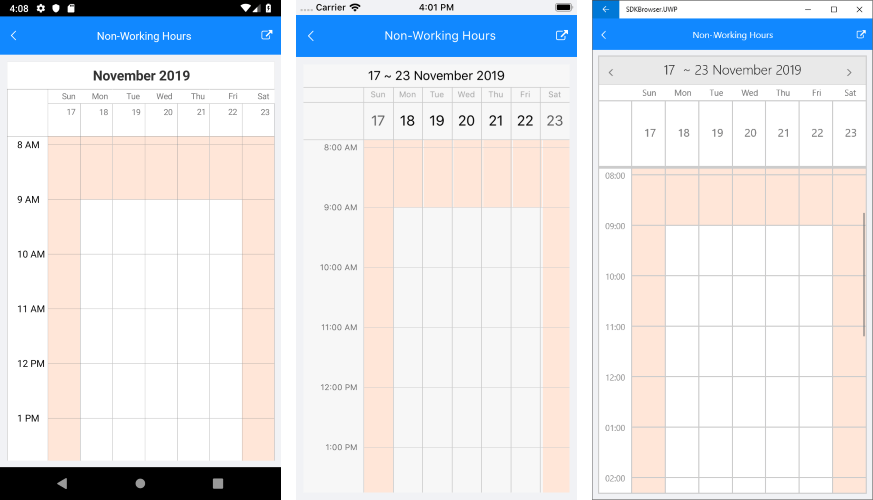

# Non-Working Hours

&nbsp;

RadCalendar provides the option to define the day working hours of the work week in DayView and MultiDay Views. This means that you can set work start/end times, and in this case the remaining hours of the day will be styled differently, so they are easily noticeable across the timeline as non-working time.

Weekends are by default considered as non-working time.

Here is a list of the properties related to non-working hours feature:

* **WorkStartTime** (*TimeSpan*): Defines the start time of the working day;
* **WorkEndTime** (*TimeSpan*): Specifies the end time of the working day;
* **AreNonWorkingHoursReadOnly** (*bool*): Defines whether non-working hours will be marked as restricted time. If AreNonWorkingHoursReadOnly is true, end users wouldn't be able to create or modify appointments at the non-working time slots.
* **NonWorkingTimeSlotsStyle** (*CalendarSpecialSlotStyle*): Used to set the background color of the non-working time slots. 

All of the listed above properties can be applied to RadCalendar through **DayViewSettings** / **MultiDayViewSettings** property of the DayView / MultiDayView, respectively.

> Non-working hours feature is implemented through the special slots functionality of RadCalendar, you could learn more about it in the [Special and Restricted Slots]() article.

## Example

Here is a sample RadCalendar definition with **MultiDay** ViewMode as well the the non-working hours feature-related properties applied:

<snippet id='calendar-nonworkinghours-xaml' />

Add the referenced MyNonWorkingHoursStyle as a Resource of type *CalendarSpecialSlotStyle* and set its BackgroundColor:

<snippet id='calendar-nonworkinghours-resources' />

Check the result in the image below:

>important A Non-Working Hours example can be found in the Calendar &amp; Scheduling/Features folder of the [SDK Samples Browser application](#sdk-browser-application).

## See Also

* [Date Properties]()
* [View Modes]()
* [Appointments]()