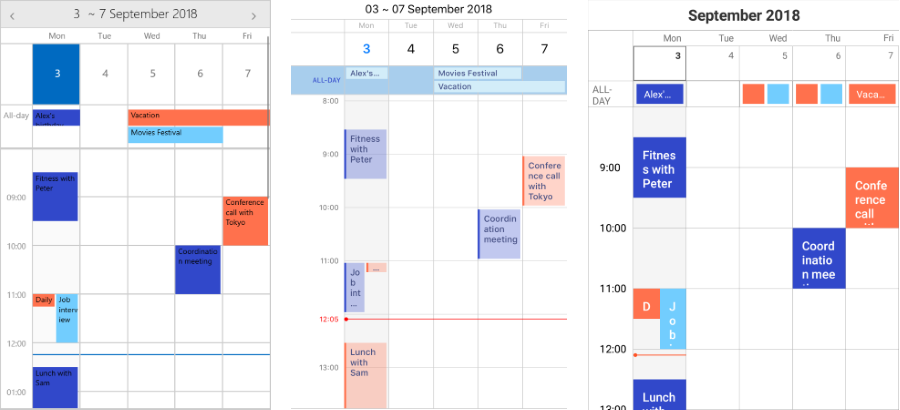

# Overview #

**Calendar &amp; Scheduling for Xamarin** allows you to easily implement various scheduling scenarios in your apps built with Xamarin.Forms. Whether you want to enable date selection or create a full-blown scheduling functionality, the Xamarin Calendar would help achieve the desired scenario. 

## Key features

* **Different view modes support**: Telerik Xamarin Calendar features year, month, week, multiday and day views. Read the [View Modes]() topic for more information.

* **Agenda View**: Through the Agenda ViewMode you can quickly and easily check the scheduled appointments grouped by date. Fore more details on how to set it up, go to [Agenda View]() topic.

* **Date Selection**: RadCalendar provides three different types of selection: Single, Multiple and Range. The selected dates can be changed programmatically or when the user taps on a calendar date cell. Read the [Selection]() article for more details.

* **Appointments**: Using RadCalendar you can create appointments for a particular date out-of-the-box. For more information on this check the [Appointments]() topic.

* **Recurrent Appointments**: The control provides the functionality to configure repeating appointments. The user has the ability to apply recurring scheduling patterns such as daily, weekly, monthly or set a range of recurrence from date to date. Check [Recurrence Overview]() topic for more information on this.

* **Scheduling UI**: RadCalendar introduces built-in UI for creation and modification of appointments, so you could provide users with the ability to directly schedule their meetings. For more details on this check [Scheduling UI]() topic.

* **Special and restricted slots**: You have the option to define a collection of special time slots in order to make them noticeable across the timeline of the Day and MultiDay views. Additionally, time slots can be marked as read-only, meaning that end users wouldn't be able to create or modify appointments at these slots. For detailed information on that functionality go to [Special and Restricted Slots]() topic.

* **Flexible Styling API**: Thanks to the control’s flexible API you have the freedom to style each separate date cell as well as the appointments according to your specifications. Read more about the Calendar styling capabilities in the [Styling]() section.

>tip Check out RadCalendar [Getting Started]() help article that shows how to use it in a basic scenario.

## See Also

- [View Modes]()
- [Selection]() 
- [Appointments]()
- [Recurrence]()
- [Scheduling UI]()
