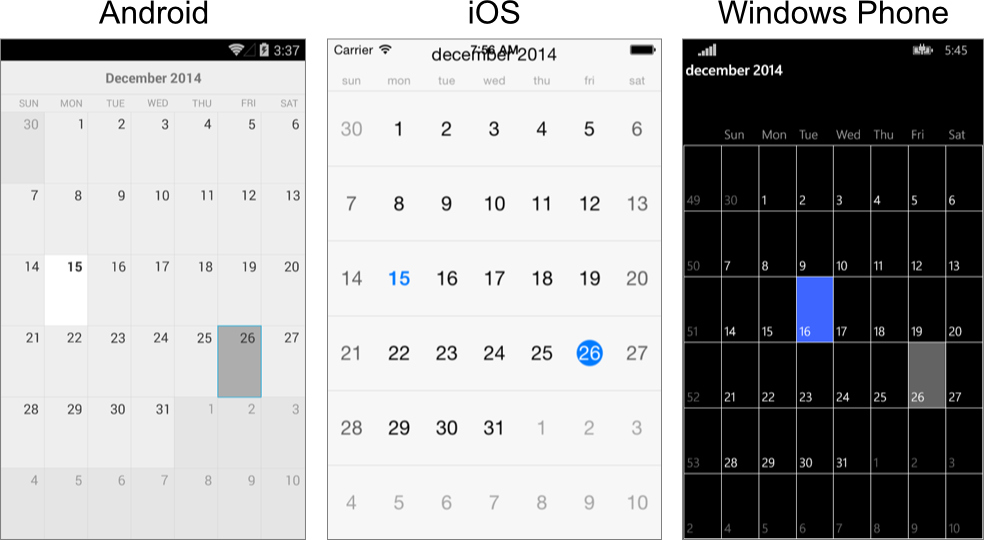

# Overview #

RadCalendar for Xamarin.Forms is a calendar component that has been designed for the mobile environment. 

## Features ##

- [**Different view modes**]()
- [**Selection**]()
- [**Appointments**]()
- [**Customization**](): RadCalendar provides number of ways to override the default calendar appearance.
	- Day names and week numbers visibility
	- Grid lines
	- Cell style customization
	- Platform specific property values
