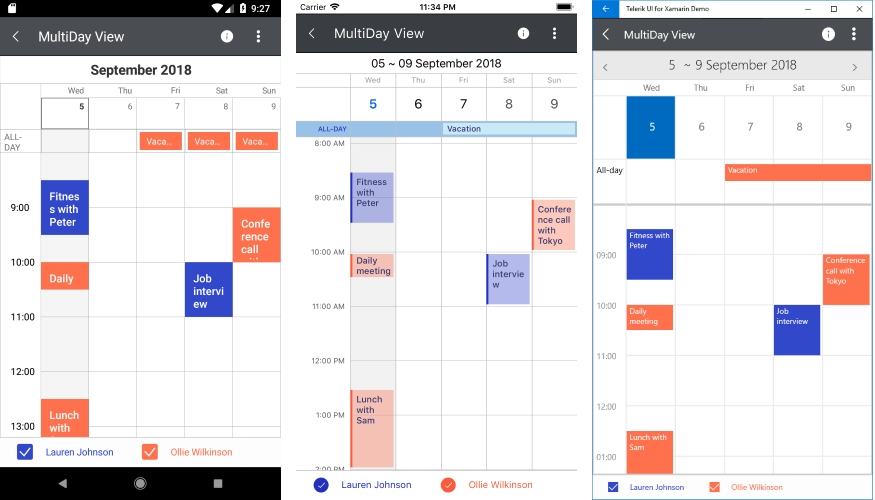

# Overview #

The **RadCalendar for Xamarin.Forms** allows you to easily implement various calendar scenarios in your apps built with Xamarin.Forms. The control capitalizes on all the innate benefits of the native UI but exposes all objects and properties in C#, allowing for no-compromise customization and flexibility.

> **RadCalendar** is available for the following platforms:
> 
> - **Android**
> - **iOS**
> - **Windows Phone 8**
> - **Windows 8.1**
> - **Windows Phone 8.1**
> - **Universal Windows Platform**

## Features ##

- [**Different view modes support**]()
- [**Selection**]()
- [**Appointments**]()