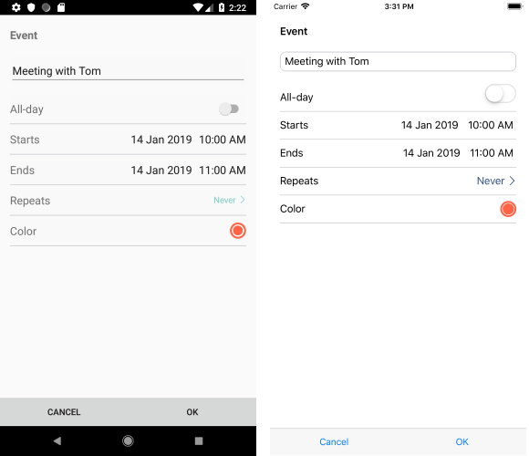
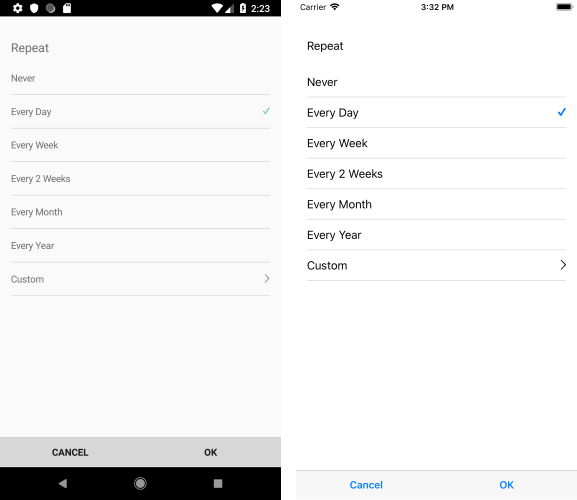
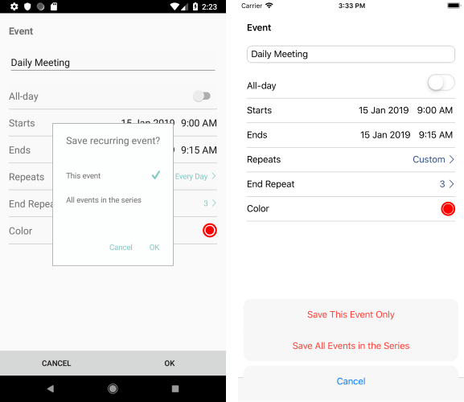

# Scheduling UI #

With R1 2019 release of Telerik UI for Xamarin RadCalendar introduces built-in UI for creation and modification of appointments, so you could provide users with the ability to directly schedule their meetings. 

This article gives an overview of the available scheduling screens in RadCalendar used for managing meetings.

In order to enable the feature, set **SchedulingUiEnabled** Boolean property of RadCalendar to *True* (by default it is *False*). 

<snippet id='calendar-scheduling-ui' />

>note Please note that scheduling screens can be shown only in DayView and MultiDayView modes. You could refer to the [View Modes]() topic for more information on the available in RadCalendar views. 

>note If you use a custom appointment (that derives from *Appointment* class), make sure to add an empty constructor - this is needed in order to properly create appointments through Scheduling UI.

* When the end user taps on an appointment, the following screen appears, giving the option to edit or delete the appointment:

* Next, you could see the edit appointment screen which is displayed with pre-selected values when "Edit" from the previous screen is tapped, or with empty fields (except "Starts" and "Ends") when the user has tapped on an empty time slot in order to create a new appointment:

* Note the "Repeats" field which is used to set a recurrence rule to the appointment. You could choose between any of the predefined recurrences or create a custom recurrence:

* If you're modifying a recurrent appointment, you'll be prompted whether the changes should be applied to the whole series or only to the current occurrence, thus making an exception of the recurrence rule:

* In order to delete an appointment, you would need to choose "Delete Event" option from the first screen shown after tapping an appointment. You would need to confirm the deletion as shown in the image below:

* If you choose to delete a recurrent appointment, you'll prompted whether the deletion operation should be applied only to the current occurrence or to the whole series:

 

In addition, you can prevent the appearance of the scheduling screens for individual appointments or time slots by handling AppointmentTapped/TimeSlotTapped events respectively and setting e.Handled to *True* inside the event handler. 

Check below a quick example on how you could prevent creating an appointment before certain time.

First, subscribe to the TimeSlotTapped event:

<snippet id='calendar-schedulingui-hookevent' />

Then, add the following event handler:

<snippet id='calendar-schedulingui-timeslottappedevent' />

## See Also

* [View Modes]()
* [Calendar Selection]()

