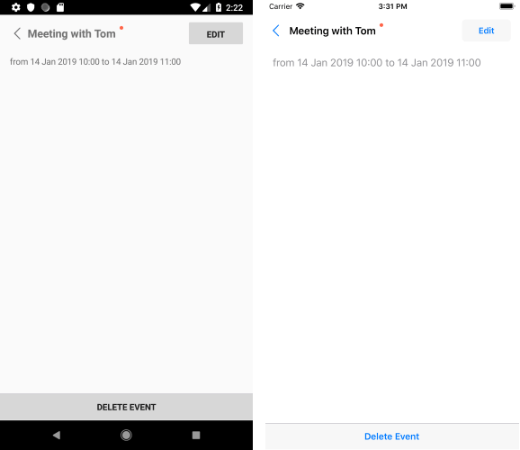

# Scheduling UI #

Telerik Xamarin RadCalendar control exposes built-in UI for creation and modification of appointments, so you could provide users with the ability to directly schedule their meetings. 

This article gives an overview of the available scheduling screens in RadCalendar used for managing meetings.

## Overview

In order to allow users to create and modify appointments by tapping on a time slot or an existing appointment, you would need to set **SchedulingUiEnabled** Boolean property of RadCalendar to *True* (by default it is *False*). 

<snippet id='calendar-scheduling-ui' />

>note Please note that scheduling screens can be shown only in DayView and MultiDayView modes. You could refer to the [View Modes]() topic for more information on the available in RadCalendar views. 

>important If you have a collection of custom appointments as a source for RadCalendar - the custom appointment class should inherit from the **Telerik.XamarinForms.Input.Appointment** class. You should also make sure to add a default constructor for the custom appointment. These requirements are needed in order to properly create appointments through Scheduling UI.

* When the end user taps on an appointment, the following screen appears, giving the option to edit or delete the appointment:



* Next, you could see the edit appointment screen which is displayed with pre-selected values when "Edit" from the previous screen is tapped, or with empty fields (except "Starts" and "Ends") when the user has tapped on an empty time slot in order to create a new appointment:


* Note the "Repeats" field which is used to set a recurrence rule to the appointment. You could choose between any of the predefined recurrences or create a custom recurrence:


* If you're modifying a recurrent appointment, you'll be prompted whether the changes should be applied to the whole series or only to the current occurrence, thus making an exception of the recurrence rule:


* In order to delete an appointment, you would need to choose "Delete Event" option from the first screen shown after tapping an appointment. You would need to confirm the deletion as shown in the image below:


* If you choose to delete a recurrent appointment, you'll prompted whether the deletion operation should be applied only to the current occurrence or to the whole series:

 

## Prevent Scheduling UIs for concrete appointments

In addition, you can prevent the appearance of the scheduling screens for individual appointments or time slots by handling AppointmentTapped/TimeSlotTapped events respectively and setting e.Handled to *True* inside the event handler. 

Check below a quick example on how you could prevent creating an appointment before certain time.

First, subscribe to the TimeSlotTapped event:

<snippet id='calendar-schedulingui-hookevent' />

Then, add the following event handler:

<snippet id='calendar-schedulingui-timeslottappedevent' />

## API for showing Add/Edit Appointment Screens

Since R2 2020 RadCalendar provides API for manually showing the default Add/Edit Appointment views used for creating and modifying appointments. 

Below you will find a list of the exposed methods and commands related to the Scheduling UIs.

### Methods

* **ShowAddAppointmentView()**
* **ShowAddAppointmentView(DateTime appointmentStartTime, DateTime appointmentEndTime)**

	Both methods can be used to display the "New Appointment" Scheduling UI with which users can add appointments to the Calendar AppointmentSource. The second method gives you the option to define the StartTime and EndTime applied in the corresponding fields when the New Appointment view is displayed.

* **ShowEditAppointmentView(Appointment appointment)** - displays the "Edit Appointment" Scheduling UI with which users can edit or delete the appointment set as a method parameter.

### Commands

If you prefer the MVVM pattern, you can take advantage of the exposed commands which provide the same functionality as the methods:

* **ShowAddAppointmentViewCommand**: Displays the "New Appointment" view for adding appointments to the Calendar AppointmentSource. 
	
	When using the **ShowAddAppointmentViewCommand**, you would need to pass an object of type *ShowAddAppointmentViewCommandContext*  as a command parameter. Through the *ShowAddAppointmentViewCommandContext* you can define the StartDate and EndDate of the new appointment.
	
* **ShowEditAppointmentViewCommand**: Displays the "Edit Appointment" view for modifying an existing appointment.
	
	When using the **ShowEditAppointmentViewCommand**, you would need to pass an object of type *ShowEditAppointmentViewCommandContext* as a command parameter. Through the *ShowEditAppointmentViewCommandContext* you can define the Appointment that will be edited.
	
#### Example

Let's have the following Calendar instance with both **ShowAddAppointmentViewCommand** and **ShowEditAppointmentViewCommand** added to Calendar's Commands collection:

```XAML
<telerikInput:RadCalendar Grid.Row="1"
                          x:Name="calendar" 
                          AppointmentsSource="{Binding Appointments}"
                          ViewMode="Day">
    <telerikInput:RadCalendar.Commands>
        <commands:ShowAddAppointmentViewCommand/>
        <commands:ShowEditAppointmentViewCommand/>
    </telerikInput:RadCalendar.Commands>
</telerikInput:RadCalendar>
```

Add the following namespaces:

```XAML
xmlns:telerikInput="clr-namespace:Telerik.XamarinForms.Input;assembly=Telerik.XamarinForms.Input"
xmlns:commands="clr-namespace:Telerik.XamarinForms.Input.Calendar.Commands;assembly=Telerik.XamarinForms.Input"            
```

For the purpose of the example, the commands will be called from two buttons:

```XAML
<StackLayout Orientation="Horizontal">
	<Button Command="{Binding Source={x:Reference calendar}, Path=Commands[0]}"
			CommandParameter="{Binding AddNewAppointmentContext}"
			Text="Create Appointment"/>
	<Button Command="{Binding Source={x:Reference calendar}, Path=Commands[1]}"
			CommandParameter="{Binding EditAppointmentContext}"
			Text="Edit First Appointment"/>
</StackLayout>
```

Let's take a look at the ViewModel class where both *AddNewAppointmentContext* and *EditAppointmentContext* objects are defined:

```C#
public class ViewModel
{
    public ViewModel()
    {
        var date = DateTime.Today;
        this.Appointments = new ObservableCollection<Appointment> {
            new Appointment {
                Title = "Meeting with Tom",
                Detail = "Sea Garden",
                StartDate = date.AddHours(10),
                EndDate = date.AddHours(11),
                Color = Color.Tomato
            },
            new Appointment {
                Title = "Lunch with Sara",
                Detail = "Restaurant",
                StartDate = date.AddHours(12).AddMinutes(30),
                EndDate = date.AddHours(14),
                Color = Color.DarkTurquoise
            }
        };

        this.AddNewAppointmentContext = new ShowAddAppointmentViewCommandContext();
        this.AddNewAppointmentContext.StartDate = DateTime.Now;
        this.AddNewAppointmentContext.EndDate = DateTime.Now.AddHours(1);

        this.EditAppointmentContext = new ShowEditAppointmentViewCommandContext();
        this.EditAppointmentContext.Appointment = this.Appointments.FirstOrDefault();
    }
	
    public ObservableCollection<Appointment> Appointments { get; set; }

    public ShowAddAppointmentViewCommandContext AddNewAppointmentContext { get; set; }

    public ShowEditAppointmentViewCommandContext EditAppointmentContext { get; set; }
}
```

## See Also

* [Appointments]()
* [View Modes]()
* [Calendar Selection]()

