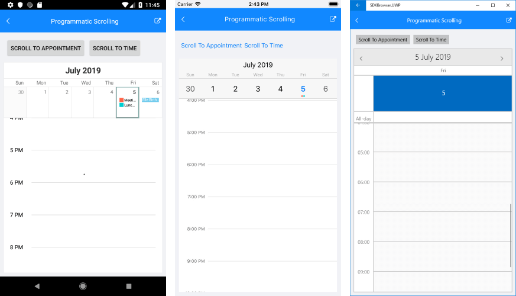
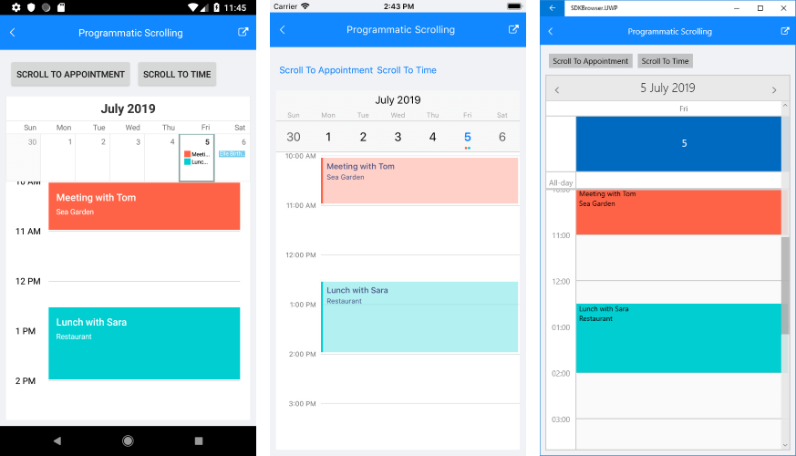

# Programmatic Scrolling

This article will explain how you could set up RadCalendar, so that the view is scrolled to specific time or a particular appointment in DayView and MultiDayView modes. 

## ScrollTimeIntoView method

ScrollTimeIntoView method scrolls the current View (Day or MultiDay) to the specified time. It accept a single parameter of type *TimeSpan*. The snippet below shows how the method could be used:

<snippet id='calendar-scrolltotime-code' />

And here is the result after the method is invoked:

## ScrollAppointmentIntoView method

Through ScrollAppointmentIntoView method you could configure the current View (Day or MultiDay) to scroll down and display the specified as a parameter appointment. Check the snippet below on how this method is called:

<snippet id='calendar-scrolltoapp-code' />

The next screenshot shows the result:

>important A sample Programmatic Scrolling example can be found in the Calendar &amp; Scheduling/Features folder of the [SDK Samples Browser application]().

## See Also

* [Date Properties]()
* [View Modes]()
* [Appointments]()