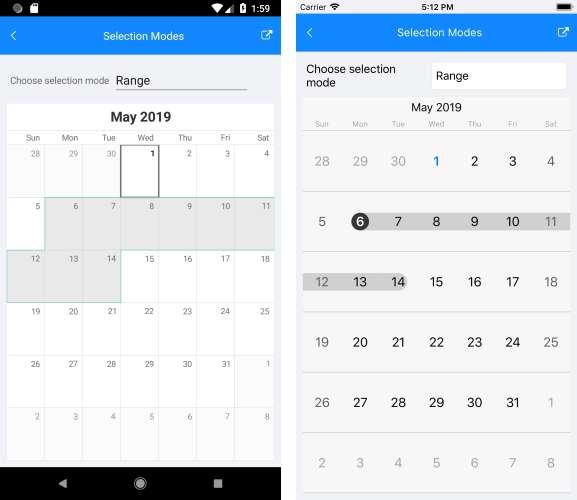

# Selection

Starting with R2 2019 RadCalendar provides three different types of selection: Single, Multiple and Range. The selected dates can be changed programmatically or when the user taps on a calendar cell.

>important Multiple and Range selection modes are supported only on Android and iOS.

The following members of RadCalendar control are related to the selection feature:

* **SelectionMode**: Enum property of type *Telerik.XamarinForms.Input.Calendar.CalendarSelectionMode* which indicates what will be the selection. It could receive the following values:

	* **None**: Selection is disabled;
	* **Single**: Each time a date cell is tapped it becomes selected and if another date cell has already been selected it is unselected;
	* **Multiple**: Each date cell that is tapped changes its selected state, this means that when a date cell is tapped for first time it gets added to the current selection and when it is tapped again it is removed from the selection.
	* **Range**: Allows the users to pick a range of consecutive dates, for example to book a hotel for this period. Here's how the control reacts to the user's gestures while in this mode - the first date cell that is tapped gets selected and is considered start of the range. When another cell is tapped, it is considered end of the range and all dates between the start and the end of the range become selected.

* **SelectedDate** (of type *DateTime?*): Defines the currently selected date. When multiple selection is enabled, this value is set to the first selected date. 
* **SelectedDates** (of type *ObservableCollection&lt;DateTime&gt;*): Reads the collection with the currently selected dates. When the selection is single, only one date could be selected – thus the collection will have count = 1. 
* **SelectedRange** (of type *Telerik.XamarinForms.Input.Calendar.DateTimeRange*): Used only with **Range** selection to give information on the selected range through its **FromDate** and **ToDate** DateTime properties.

The table below lists the supported selection modes for each view mode:
|					| Selection Mode |
| ----------------- | -------------- |
| 	View Mode 		|	None   | Singe | Multiple | Range |
| ----------------- | -------- | ----- | -------- | ----- |
| Month 			| &#x2714; | &#x2714;	| &#x2714; | &#x2714; |
| Day 				| &#x2714; | &#x2714;	| - 	   | -	   	  |
| MultiDay 			| &#x2714; | &#x2714;	| -  	   | -        |
| Agenda			| -		   | -			| - 	   | -		  |
| Year				| -		   | -			| - 	   | - 		  |
| Week				| &#x2714; | &#x2714;	| &#x2714; | &#x2714; |
| MonthNames		| -		   | -			| -		   | -		  |
| YearNumbers		| -		   | -			| -		   | -		  |
| Flow				| -		   | -			| - 	   | -		  |

For more details about the supported view modes for each platform, please check the [Calendar and Scheduling View Modes article]().

The snippet belows shows how you could apply **SelectionMode** property to RadCalendar:

<snippet id='calendar-selection-xaml' />

The result can be seen on the picture bellow:

## See Also

* [Date Properties]()
* [View Modes]()
* [Events]()