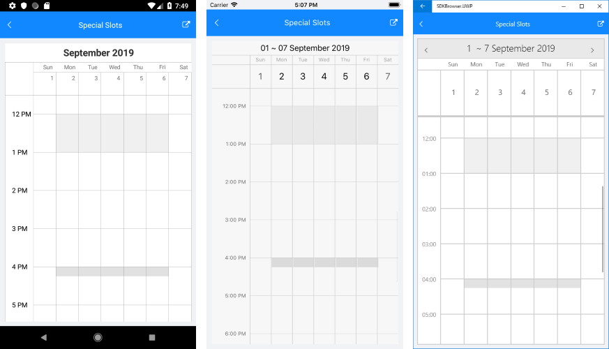

# Special and Restricted Slots

With R3 2019 release of Telerik UI for Xamarin RadCalendar provides the option to define a collection of special and restricted time slots in order to make them noticeable across the timeline of the Day and MultiDay views. 

You just need to prepare a collection of **SpecialSlot** objects and assign it to **SpecialSlotsSource** collection of the DayViewSettings / MultiDaySettings for Day/MultiDay view, respectively.

Every SpecialSlot has the following properties:

* **StartDate**;
* **EndDate**;
* **RecurrencePattern**: Defines whether the slot will be displayed for repeating days;
* **IsReadOnly**: When set to **True** the slot is disabled (restricted), meaning the end user wouldn't be able to create or modify appointments at that slot.

Below you can find a quick examle how create special and restricted slots.

First, create a ViewModel class with a collection of **SpecialSlot** objects. In the example two repeating special slots are added for rest hours during weekdays. In addition, the first slot which represents a lunch break, is set as restricted time.

<snippet id='calendar-specialslots-viewmodel' />

Then, add RadCalendar definition with **MultiDay** ViewMode and **MultiDaySettings** applied:

<snippet id='calendar-specialslots-xaml' />

Last step is to set the BindingContext to the ViewModel class:

<snippet id='calendar-specialslots-setvm' />

Here is the result after executing the example above on different emulators:

## Setting a separate Style for different slots

>important A sample Programmatic Scrolling example can be found in the Calendar &amp; Scheduling/Features folder of the [SDK Samples Browser application]().

## See Also

* [Date Properties]()
* [View Modes]()
* [Appointments]()