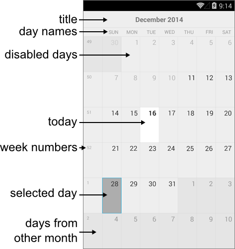

# Visual Structure #

Here are described all visual elements and terms used in a standard RadCalendar control.

## Legend ##

- **Calendar title**: 
- **Day names**:
- **Week numbers**:
- **Today date**:
- **Selected day**:
- **Disabled dates**:
- **Days from other month**: