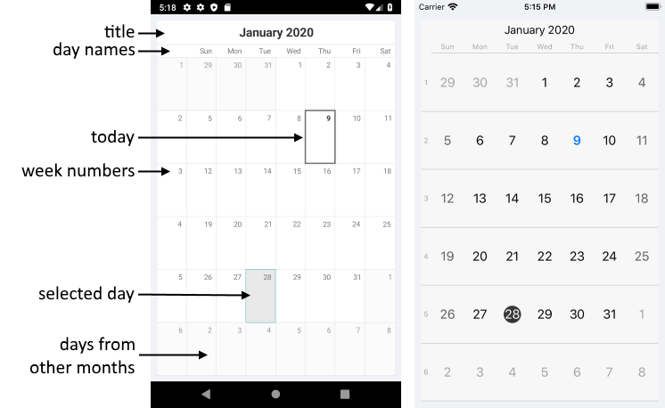

# Visual Structure #

Here are described all visual elements and terms used in a standard RadCalendar control.

## Legend ##

- **Calendar title**: The title element of the calendar.
- **Day names**: The names of the week days.
- **Week numbers**: The number of the weeks in the current year.
- **Today date**: The today date. 
- **Selected day**: The selected date.
- **Disabled dates**: Dates that are not enabled for selection and navigation.
- **Days from other month**: Days that are not from the current month.