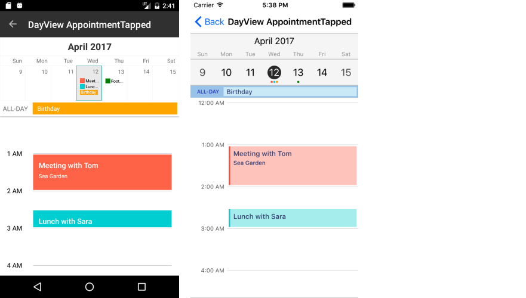

# Appointments #

## Creating an Appointment ##

RadCalendar can display appointments by setting its **AppointmentsSource** property. It accepts a collection of objects, which should implement the **Telerik.XamarinForms.IAppointment** interface. This interface defines 6 members:

- **StartDate** *(DateTime)*
- **EndDate** *(DateTime)*
- **Title** *(string)*
- **Detail** *(string)*
- **Color** *(Color)*
- **IsAllDay** *(bool)*

>caution In **R2 2017** we have introduced a breaking change in the **IAppointment** interface by adding the **Detail** property. 

## Example ##

<snippet id='calendar-gettingstarted-appointmentssource-csharp'/>

where **Appointment** class implements **IAppointment** interface:

<snippet id='calendar-getting-started-appointment-class'/>

#### **Figure 1: Appearance of the RadCalendar control in month view mode**

#### **Figure 2: Appearance of the RadCalendar control in day view mode**

## Events ##
 
**AppointmentTapped**(AppointmentTappedEventArgs): Occurs when you tap over a specific appointment. It can be used to get all the information regarding the appointment.

## See Also

* [Navigation and View Mode]()
* [Calendar Selection]()

