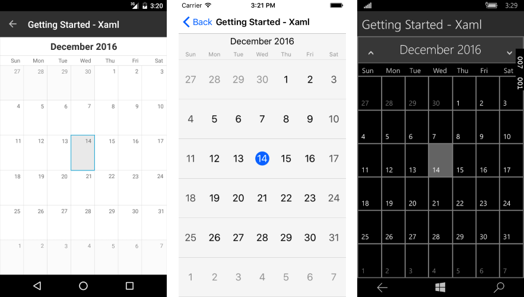

# Selection

The RadCalendar provides a selection. The selected dates change when the user taps on a cell of the calendar.

## Properties
 
- **SelectedDate** (DateTime?): Gets or sets the currently selected date. 

## Events

- **SelectionChanged** (ValueChangedEventArgs<object>): Occurs when the selected date is changed programmatically or due to user interaction.

## Example

In the following code snippet the selection is set to a specific cell using the code:

	RadCalendar calendar = new RadCalendar();
	calendar.SelectedDate = new DateTime(2016, 12, 14);

The result can be seen on the picture bellow:

