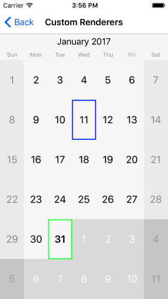

# Custom Calendar Renderer

Sometimes, you might find that certain feature is available in the native control on a given platform, but is not exposed in Xamarin Forms or you might want to customize the calendar look for each platform. This is when you would need to create a custom renderer. This will allow you to access the native control and configure it as per your needs.

>The native **Calendar** control documentation can be found [here](http://docs.telerik.com/devtools/ios/calendar/overview).

## Example

Let us consider the following example: we need to customize how the calendar looks on iOS. Create a class which inherits from Telerik.XamarinForms.InputRenderer.iOS.CalendarRenderer and override the CreateCalendarDelegateOverride method:

<snippet id='calendar-features-custom-renderers-ios-renderer'/>

The method should return object of class delivered from Telerik.XamarinForms.InputRenderer.iOS.CalendarDelegate:

<snippet id='calendar-features-custom-renderers-custom-delegate'/>

Here is the result:

