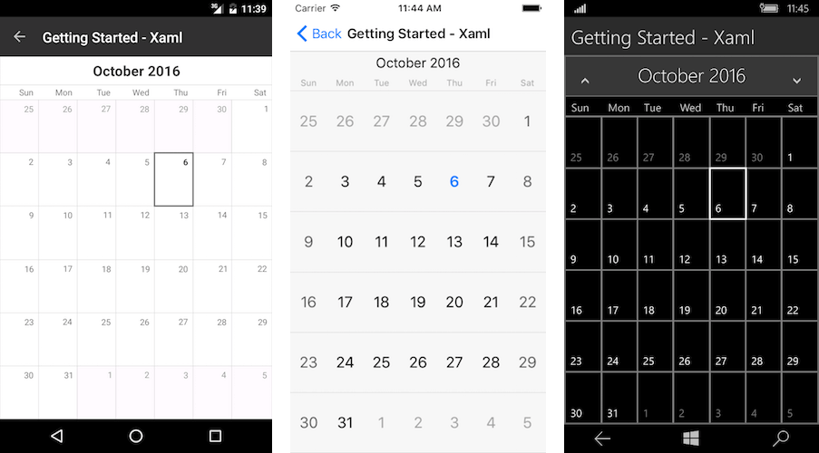

# Getting Started
   
This example will guide you through the steps needed to add a basic **RadCalendar** control in your application.

>Before you proceed, please, take a look at these articles and follow the instructions to setup your app:

>- [Setup on Windows]()
>- [Setup on Mac]()

## Example

If your app is setup, you are ready to add a **RadCalendar** control as content of your page.

<snippet id='calendar-gettingstarted-xaml'/>

<snippet id='calendar-gettingstarted-csharp'/>

You also need to add the following namespace:

<snippet id='xmlns-telerikinput'/>
<snippet id='ns-telerikinput'/>

Finally, set the calendar as content of your page.

Here is the result:

## See Also

- [Register Calendar Renderers]()
- [Calendar Required Assemblies]()
- [Project Wizard]()
- [Getting Started on Mac]()
