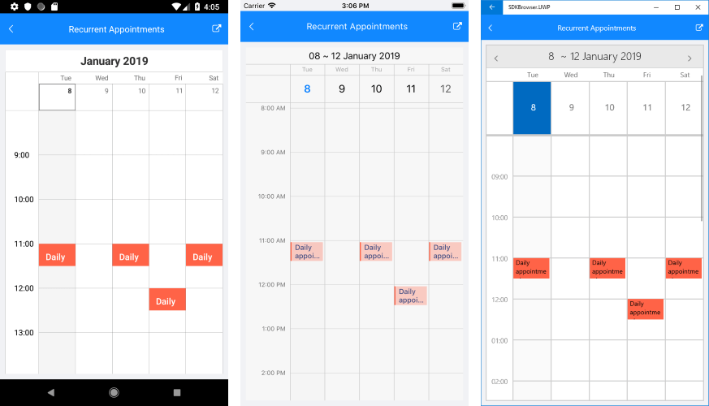

# Overview

**RadCalendar** provides the functionality to configure repeating appointments. The user has the ability to apply recurring scheduling patterns such as daily, weekly, monthly or set a range of recurrence from date to date. The flexible rule mechanism covers the most common recurrence scenarios. Furthermore, you also have the option to handle the exceptions from this rule.        

The purpose of this overview is to give you a straight-forward way how to create and apply a recurrence pattern, rule and exception. If you want to dive deeper into the recurrence feature of the RadCalendar, check out the following topics:

* [Recurrence Pattern]()

* [Recurrence Rule]()

**RadCalendar** includes support for recurring events on daily, weekly, monthly and yearly basis. Exceptions to the recurrence rules are also permitted. To support this recurrence behavior, the **Telerik.XamarinForms.Input.Appointment** class includes the __RecurrenceRule__ property. When an appointment is promoted into a recurring event its __RecurrenceRule__ is set with correct __RecurrencePattern__.        

>If the user modifies an individual appointment occurrence, an exception is created. This exception is added to the __RecurrenceRule__ of the master appointment along with its specific date.          

Consider the following example:

* Create a sample appointment that starts at 11:00 AM and lasts half an hour: 

<snippet id='calendar-recurrentappts-createappt' />

* Create a daily recurrence pattern, that specifies a limit of 5 occurrences for the appointment: 

<snippet id='calendar-recurrentappts-recurrencepattern' />

* Set the recurrence rule to appointment: 

<snippet id='calendar-recurrentappts-setrule' />

* Add exception date to the recurrence rule: 

<snippet id='calendar-recurrentappts-exceptiondate' />

* Create an exception appointment: 

<snippet id='calendar-recurrentappts-exceptionappt' />

Finally when you add the created appointment to the AppointmentsSource of RadCalendar, you'll get the following generated appointments: 

## See Also

* [Appointments]()
* [Recurrence Pattern]()

