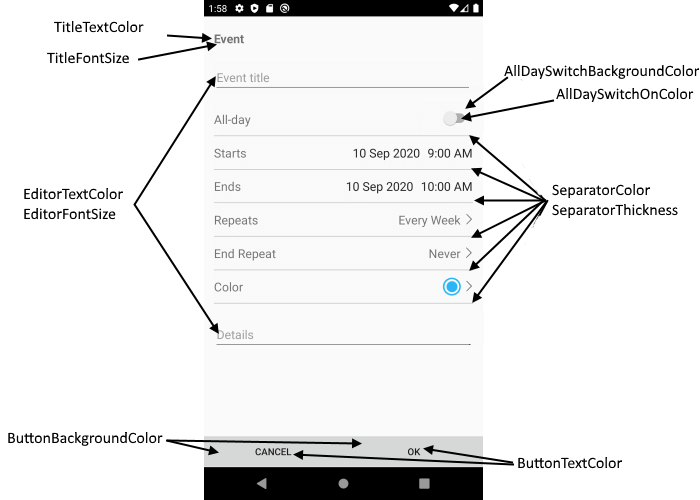
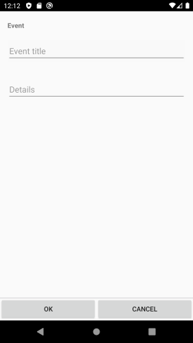

# Add Appointment View

Add Appointment View allows the user to change the main appointment properties like `Title`, `Start` and `End Date`, `Detail`, `Recurrence`, whether it will be All Day appointment.

## Visual Structure of Add Appointment View 


## Control Template

> The control template for the **AddAppointmentView** can be found at the [following location in our SDKBrowser Application](https://github.com/telerik/xamarin-forms-sdk/blob/master/XamarinSDK/SDKBrowser/SDKBrowser/Examples/CalendarControl/SchedulingCategory/SchedulingUIViews/AddAppointmentView.xaml).

## Customization Properties 

In addition, to avoid editing the whole control template, there are additional properties which you can use to customize the look of the AddAppointmnetView:

* **ControlTemplate**(*controlTemplate*): Defines the Control Template of the AddAppintmentView.
* **AllDaySwitchBackgroundColor**(*Xamarin.Forms.Color*): Defines the background color of the AllDay switch.
* **AllDaySwitchOnColor**(*Xamarin.Forms.Color*): Defines the switch on color.
* **TitleFontSize**(*double*): Defines the font size of the appointment title.
* **TitleTextColor**(*Xamarin.Forms.Color*): Defines the text color of the appointment title.
* **SeparatorColor**(*Xamarin.Forms.Color*): Defines the color of the separator (the lines which devide each appointment property).
* **SeparatorThickness**(*Xamarin.Forms.Thickness*): Defines the thickness of the separators (the lines which devide each appointment property).
* **ButtonBackgroundColor**(*Xamarin.Forms.Color*): Defines the background color for the OK and Cancel buttons.
* **ButtonTextColor**(*Xamarin.Forms.Color*): Defines the text color of the OK and Cancel buttons.
* **EditorTextColor**(*Xamarin.Forms.Color*): Defines the text color of the editors.
* **EditorFontSize**(*double*): Defines the font size of the editor: Title Editor, Detail Editor, etc.
* **BackgroundColor**(*Xamarin.Forms.Color*): Defines the background color of the AddAppointmentView.



>important These properties or the ControlTemplate can be changed by applying style with TargetType="telerikInput:AddAppointmentView" in the resources of the “App.xaml” file of your application. 

### Example

```XAML
<ControlTemplate x:Key="AddAppointmentViewControlTemplate">
    <Grid RowSpacing="0" 
    BackgroundColor="Transparent"
    BindingContext="{TemplateBinding BindingContext}">
        <telerikPrimitives:RadPopup.Popup>
            <telerikPrimitives:RadPopup IsOpen="{Binding IsPopupOpen}"
                                Content="{Binding PopupContent}"
                                VerticalOffset="{Binding PopupVerticalOffset}"
                                Placement="Center"
                                AnimationType="Fade"
                                OutsideBackgroundColor="#6F000000">
            </telerikPrimitives:RadPopup>
        </telerikPrimitives:RadPopup.Popup>
        <Grid.RowDefinitions>
            <RowDefinition/>
            <RowDefinition Height="Auto" />
        </Grid.RowDefinitions>
        <ScrollView >
            <StackLayout Padding="16, 20, 16, 0" 
                    Spacing="0">

                <!--Screen Title-->
                <Label Text="{telerikCommon:Localize Calendar_AppointmentEventTitle}"
                FontAttributes="Bold"
                HorizontalOptions="Start" />

                <!--Appointment Title-->
                <telerikPrimitives:RadBorder BorderColor="Red" 
                                        Margin="{OnPlatform iOS='0, 23, 0, 20', Default='0, 23, 0, 14'}"
                                        BorderThickness="{OnPlatform iOS=1, Default=0}"
                                        CornerRadius="{OnPlatform iOS=10}">

                    <Entry Text="{Binding Appointment.Title, Mode=TwoWay}" 
                    Placeholder="{telerikCommon:Localize Calendar_AppointmentTitlePlaceholder}">
                    </Entry>

                </telerikPrimitives:RadBorder>

                <!--Appointment Details-->
                <Editor Text="{Binding Appointment.Detail}"
                AutoSize="TextChanges"
                Margin="{OnPlatform iOS='0, 23, 0, 20', Default='0, 23, 0, 14'}"
                Placeholder="{telerikCommon:Localize Calendar_DetailsEditorPlaceholderText}">
                    <Editor.Effects>
                        <telerikCommon:NoTextOffsetEffect />
                    </Editor.Effects>
                </Editor>
            </StackLayout>
        </ScrollView>

        <telerikPrimitives:RadBorder BorderColor="#C8C7CC"
                                BorderThickness="0, 1, 0, 0" 
                                Grid.Row="1">
            <Grid ColumnSpacing="0">
                <Button Grid.Column="0"
                Command="{Binding SaveAppointmentCommand}"
                            
                Text="{telerikCommon:Localize Calendar_AppointmentOKButton}" />
                <Button Grid.Column="1"
                Command="{Binding CancelCommand}"
                           
                Text="{telerikCommon:Localize Calendar_AppointmentCancelButton}" />


            </Grid>
        </telerikPrimitives:RadBorder>
    </Grid>
</ControlTemplate>

<Style TargetType="telerikInput:AddAppointmentView">
    <Setter Property="SeparatorThickness" Value="2"/>
    <Setter Property="ControlTemplate" Value="{StaticResource AddAppointmentViewControlTemplate}"/>
</Style>
```

In addition you will need to add the following namespace: 

```XAML
xmlns:telerikCommon="clr-namespace:Telerik.XamarinForms.Common;assembly=Telerik.XamarinForms.Common"
xmlns:telerikInput="clr-namespace:Telerik.XamarinForms.Input;assembly=Telerik.XamarinForms.Input"
xmlns:telerikPrimitives="clr-namespace:Telerik.XamarinForms.Primitives;assembly=Telerik.XamarinForms.Primitives"
```

Here is the Result:



> If you customize the control template using ControlTemplate property, you need to define first the control template then the style in the App.xaml Resources. Also when the control template is defined in the App.xaml resources it will be applied for all RadCalendar controls used in the application. If you want to apply the control template on a concreate calendar control, you will need to merge the resource dictionary to the concreate page where the calendar is defines. Example can be found in out [Telerik Sample Application](https://github.com/telerik/telerik-xamarin-forms-samples/tree/master/QSF/QSF/Examples/CalendarControl/SchedulingUICustomizationExample).  

## See Also

* [Appointment Summery View]()
* [Delete Appointment View]()
* [Color Picker View]()
* [Custom Recurrence View]()
* [Repeat Appointment View]()
