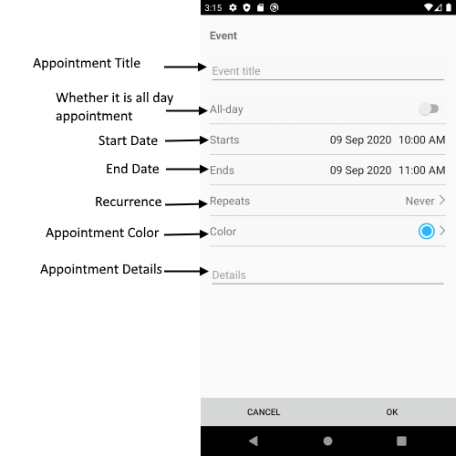

# Scheduling UI Add Appointment View

Add Appointment View allows the user to change the main appointment properties like `Title`, `Start` and `End Date`, `Detail`, `Recurrence`, whether it will be All Day appointment.

## Visual Structure of Add Appointment View 



## Control Template

The control template for the **AddAppointmentView** can be found at the [following location in our SDKBrowser Application](https://github.com/telerik/xamarin-forms-sdk/blob/master/XamarinSDK/SDKBrowser/SDKBrowser/Examples/CalendarControl/SchedulingCategory/SchedulingUIViews/AddAppointmentView.xaml).

## Partial Customization Options 

In addition, to avoid editing the whole control template, there are additional properties which you can use to customize the look of the AddAppointmnetView:

* **ControlTemplate**(*controlTemplate*): Defines the Control Template of the AddAppintmentView.
* **AllDaySwitchBackgroundColor**(*Xamarin.Forms.Color*): Defines the background color of the AllDay switch.
* **AllDaySwitchOnColor**(*Xamarin.Forms.Color*): Defines the switch on color.
* **TitleFontSize**(*double*): Defines the font size of the appointment title.
* **TitleTextColor**(*Xamarin.Forms.Color*): Defines the text color of the appointment title.
* **SeparatorColor**(*Xamarin.Forms.Color*): Defines the color of the separator (the lines which devide each appointment property).
* **SeparatorThickness**(*Xamarin.Forms.Thickness*): Defines the thickness of the separators (the lines which devide each appointment property).
* **ButtonBackgroundColor**(*Xamarin.Forms.Color*): Defines the background color for the OK and Cancel buttons.
* **ButtonTextColor**(*Xamarin.Forms.Color*): Defines the text color of the OK and Cancel buttons.
* **EditorTextColor**(*Xamarin.Forms.Color*): Defines the text color of the editors.
* **EditorFontSize**(*double*): Defines the font size of the editor: Title Editor, Detail Editor, etc.
* **BackgroundColor**(*Xamarin.Forms.Color*): Defines the background color of the AddAppointmentView.


>important These properties or the ControlTemplate can be changed by applying style with TargetType="telerikInput:AddAppointmentView" in the resources of the “App.xaml” file of your application. 

### Example

```XAML
<Style TargetType="telerikInput:AddAppointmentView">
    <Setter Property="SeparatorThickness" Value="4" />
    <Setter Property="AllDaySwitchOnColor" Value="Red"/>
    <Setter Property="BackgroundColor" Value="LightBlue"/>
</Style>
```

In addition you will need to add the following namespace: 

<snippet id='xmlns-telerikinput'/>

## See Also

* [Appointment Summery View]()
* [Delete Appointment View]()
* [Color Picker View]()
