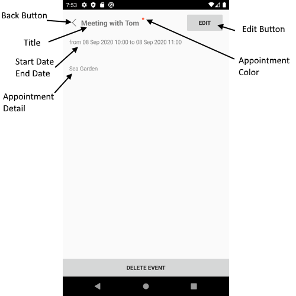

# Appointment Summary View

Appointment Summary View displays brief information about the appointment. The Appointment's Title, Details, Start Date and End Date, Recurrence, Detail.
 
## Visual Structure of Appointment Summary View 



## Control Template

> The control template for the **AppointmentSummaryView** can be found at the [following location in our SDKBrowser Application](https://github.com/telerik/xamarin-forms-sdk/blob/master/XamarinSDK/SDKBrowser/SDKBrowser/Examples/CalendarControl/SchedulingCategory/SchedulingUIViews/AppointmentSummaryView.xaml).

## Customization Properties 

In addition, to avoid editing the whole control template, there are additional properties which you can use to customize the look of the **AppointmentSummaryView**: 

* **ControlTemplate**(*controlTemplate*): Defines the Control Template of the AppintmentSummaryView.
* **AppointmentTitleFontSize**(*double*): Defines the font size of the appointment title.
* **AppointmentTitleTextColor**(*Xamarin.Forms.Color*): Defines the text color of the appointment title.
* **DetailsTextColor**(*Xamarin.Forms.Color*): Defines the text color of the appointment detail.
* **DetailsFontSize**(*Xamarin.Forms.Color*): Defines the font size of the appointment detail text.
* **ButtonBackgroundColor**(*Xamarin.Forms.Color*): Defines the background color for the Delete event button.
* **ButtonTextColor**(*Xamarin.Forms.Color*): Defines the text color of the Delete event button.
* **BackgroundColor**(*Xamarin.Forms.Color*): Defines the background color of the AppintmentSummaryView.


>important These properties or the ControlTemplate can be changed by applying style with TargetType="telerikInput:AppointmentSummaryView" in the resources of the “App.xaml” file of your application. 

> If you customize the control template using ControlTemplate property, you need to define first the control template then the style in the App.xaml Resources. Also when the control template is defined in the App.xaml resources it will be applied for all RadCalendar controls used in the application. If you want to apply the control template on a concreate calendar control, you will need to merge the resource dictionary to the concreate page where the calendar is defines. Example can be found in out [Telerik Sample Application](https://github.com/telerik/telerik-xamarin-forms-samples/tree/master/QSF/QSF/Examples/CalendarControl/SchedulingUICustomizationExample).  

### Example

```XAML
<Style TargetType="telerikInput:AppointmentSummaryView">
    <Setter Property="DetailsFontSize" Value="24"/>
    <Setter Property="AppointmentTitleTextColor" Value="LightBlue"/>
    <Setter Property="BackTextColor" Value="Blue"/>
</Style>
```

In addition, you will need to add the following namespace: 

<snippet id='xmlns-telerikinput'/>

## See Also

* [Delete Appointment View]()
* [Color Picker View]()
