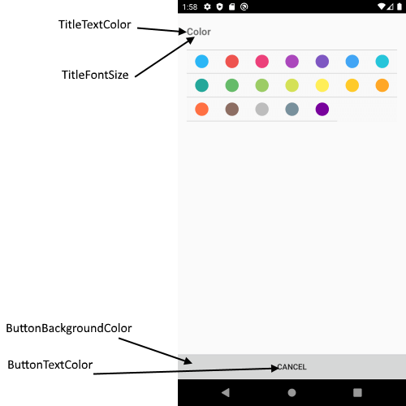

# Color Picker View

ColorPickerView is a view for picking color which is applied to the appointment.

## Visual Structure of Color Picker View


## Control Template

> The control template for the **ColorPickerView** can be found at the [following location in our SDKBrowser Application](https://github.com/telerik/xamarin-forms-sdk/blob/master/XamarinSDK/SDKBrowser/SDKBrowser/Examples/CalendarControl/SchedulingCategory/SchedulingUIViews/ColorPickerView.xaml).

## Customization Properties 

In addition, to avoid editing the whole control template, there are additional properties which you can use to customize the look of the **ColorPickerView**:

* **ControlTemplate**(*controlTemplate*): Defines the Control Template of the ColorPickerView.
* **TitleFontSize**(*double*): Defines the font size of the color picker title.
* **TitleTextColor**(*Xamarin.Forms.Color*): Defines the text color of the color picker title.
* **ButtonBackgroundColor**(*Xamarin.Forms.Color*): Defines the background color of the Cancel button.
* **ButtonTextColor**(*Xamarin.Forms.Color*): Defines the text color of the Cancel button.
* **BackgroundColor**(*Xamarin.Forms.Color*): Defines the background color of the ColorPickerView.



>important These properties or the ControlTemplate can be changed by applying style with TargetType="telerikInput:ColorPickerView" in the resources of the  “App.xaml” file of your application. 

### Example:

```XAML
<Style TargetType="telerikInput:ColorPickerView">
    <Setter Property="ButtonBackgroundColor" Value="Blue"/>
    <Setter Property="TitleFontSize" Value="16"/>
    <Setter Property="BackgroundColor" Value="LightGray"/>
</Style>
```

In addition, you will need to add the following namespace: 

<snippet id='xmlns-telerikinput'/>

## See Also

* [Appointment Summery View]()
* [Delete Appointment View]()
* [Custom Recurrence View]()
* [Repeat Appointment View]()
