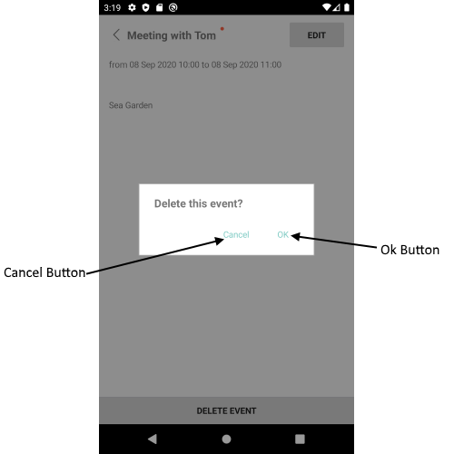

# Scheduling UI - Delete Appointment View

DeleteAppointmentView – view for choosing appointment deleting options.

## Visual Structure of Delete Appointment View



## Control Template

The control template for the **DeleteAppointmentView** can be found at the [following location in our SDKBrowser Application](https://github.com/telerik/xamarin-forms-sdk/blob/master/XamarinSDK/SDKBrowser/SDKBrowser/Examples/CalendarControl/SchedulingCategory/SchedulingUIViews/DeleteAppointmentView.xaml).

## Partial Customization Options 

* **ControlTemplate**(*ControlTemplate*): Defines the control template of the DeleteAppointmentView.
* **BackgroundColor**(*Xamarin.Forms.Color*): Defines the background color of the DeleteAppointmentView.

>important These properties or the ControlTemplates can be changed by applying style with TargetType="telerikInput:DeleteAppointmentView" in the resources of the “App.xaml” file of your application. 

### Example:

```XAML
<Style TargetType="telerikInput:DeleteAppointmentView">
    <Setter Property="BackgroundColor" Value="Red"/>
</Style>
```

In addition you will need to add the following namespace: 

<snippet id='xmlns-telerikinput'/>

## See Also

* [Color Picker View]()
* [View Modes]()
* [Calendar Selection]()
