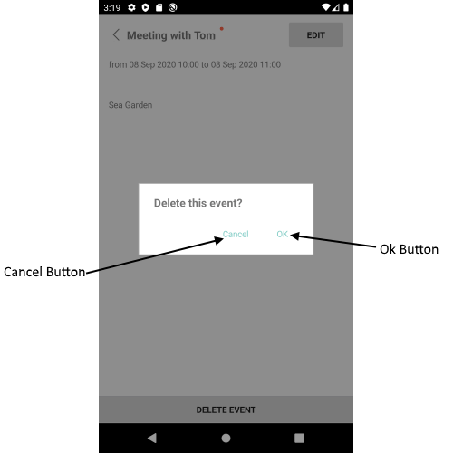

# Delete Appointment View

DeleteAppointmentView – view for choosing appointment deleting options.

## Visual Structure of Delete Appointment View



## Control Template

> The control template for the **DeleteAppointmentView** can be found at the [following location in our SDKBrowser Application](https://github.com/telerik/xamarin-forms-sdk/blob/master/XamarinSDK/SDKBrowser/SDKBrowser/Examples/CalendarControl/SchedulingCategory/SchedulingUIViews/DeleteAppointmentView.xaml).

## Customization Properties 

* **ControlTemplate**(*ControlTemplate*): Defines the control template of the DeleteAppointmentView.
* **BackgroundColor**(*Xamarin.Forms.Color*): Defines the background color of the DeleteAppointmentView.

>important These properties or the ControlTemplates can be changed by applying style with TargetType="telerikInput:DeleteAppointmentView" in the resources of the “App.xaml” file of your application. 

> If you customize the control template using ControlTemplate property, you need to define first the control template then the style in the App.xaml Resources. Also when the control template is defined in the App.xaml resources it will be applied for all RadCalendar controls used in the application. If you want to apply the control template on a concreate calendar control, you will need to merge the resource dictionary to the concreate page where the calendar is defines. Example can be found in out [Telerik Sample Application](https://github.com/telerik/telerik-xamarin-forms-samples/tree/master/QSF/QSF/Examples/CalendarControl/SchedulingUICustomizationExample).  

### Example:

```XAML
<Style TargetType="telerikInput:DeleteAppointmentView">
    <Setter Property="BackgroundColor" Value="Red"/>
</Style>
```

In addition you will need to add the following namespace: 

<snippet id='xmlns-telerikinput'/>

## See Also

* [Add Appointment View]()
* [Appointment Summery View]()
* [Color Picker View]()
* [Custom Recurrence View]()
* [Repeat Appointment View]()
* [End Repeat Appointment View]()
