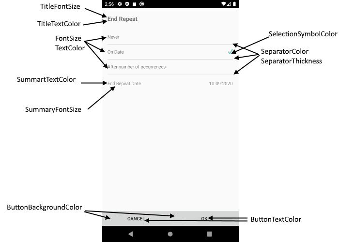

# End Repeat Appointment View

EndRepeatAppointmentView is a view for choosing when recurring appointments end.

## Visual Structure of End Repeat Appointment View


## Control Template

> The control template for the **EndRepeatAppointmentView** can be found at the [following location in our SDKBrowser Application](https://github.com/telerik/xamarin-forms-sdk/blob/master/XamarinSDK/SDKBrowser/SDKBrowser/Examples/CalendarControl/SchedulingCategory/SchedulingUIViews/EndRepeatAppointmentView.xaml).

## Customization Properties 

In addition, to avoid editing the whole control template, there are additional properties which you can use to customize the look of the EndRepeatAppointmentView: 

* **ControlTemplate**(*controlTemplate*): Defines the Control Template of the EndRepeatAppointmentView.
* **TitleFontSize**(*double*): Defines the font size of the EndRepeatAppointmentView title.
* **TitleTextColor**(*Xamarin.Forms.Color*): Defines the text color of the EndRepeatAppointmentView title.
* **FontSize**(*double*): Defines the font size of the end repeat appointment options.
* **TextColor**(*Xamarin.Forms.Color*): Defines the text color of the end repeat appointment options.
* **SeparatorColor**(*Xamarin.Forms.Color*): Defines the color of the separator (the lines which devide each end repeat appointment option).
* **SeparatorThickness**(*Xamarin.Forms.Thickness*): Defines the thickness of the separators (the lines which devide each end repeat appointment option).
* **ButtonBackgroundColor**(*Xamarin.Forms.Color*): Defines the background color for the OK and Cancel buttons.
* **ButtonTextColor**(*Xamarin.Forms.Color*): Defines the text color of the OK and Cancel buttons.
* **SelectionSymbolColor**(*Xamarin.Forms.Color*): Defines the color of the symbol when end repeat appointment option is selected.
* **SummaryTextColor**(*Xamarin.Forms.Color*): Defines the text color of the summary text (when the repeat appointment ends).
* **SummaryFontSize**(*double*): Defines the font size of the summary text (when the repeat appointment ends).
* **BackgroundColor**(*Xamarin.Forms.Color*): Defines the background color of the EndRepeatAppointmentView.



>important These properties or the ControlTemplate can be changed by applying style with TargetType="telerikInput:EndRepeatAppointmentView" in the resources of the “App.xaml” file of your application. 

### Example

```XAML
<Style TargetType="telerikInput:EndRepeatAppointmentView">
    <Setter Property="TextColor" Value="Red"/>
    <Setter Property="TitleTextColor" Value="Red"/>
    <Setter Property="TitleFontSize" Value="20"/>
	...
</Style>
```

In addition, you will need to add the following namespace: 

<snippet id='xmlns-telerikinput'/>

## See Also

* [Add Appointment View]()
* [Appointment Summery View]()
* [Delete Appointment View]()
* [Color Picker View]()
* [Custom Recurrence View]()
* [Repeat Appointment View]()
